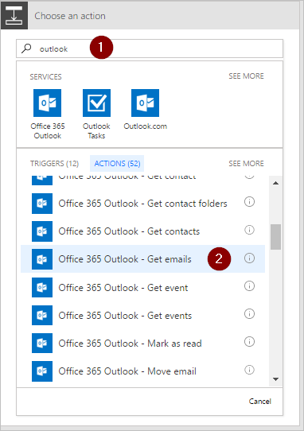
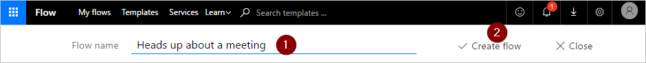

# Use a ação aplicar a cada no Microsoft Flow para processar uma lista de itens periodicamente
[!INCLUDE [view-pending-approvals](includes/cc-rebrand.md)]
Muitos gatilhos podem iniciar imediatamente um fluxo com base em um evento, como quando um novo email chega em sua caixa de entrada. Esses gatilhos são ótimos, mas às vezes você deseja executar um fluxo que consulta uma fonte de dados em um agendamento predefinido, realizando determinadas ações com base nas propriedades dos itens na fonte de dados. Para fazer isso, o fluxo pode ser iniciado em uma agenda (por exemplo, uma vez por dia) e usar uma ação de loop, como **aplicar a cada** para processar uma lista de itens. Por exemplo, você pode usar **aplicar a cada** para atualizar registros de um banco de dados ou lista de itens do Microsoft SharePoint.

Neste passo a passo, criaremos um fluxo que é executado a cada 15 minutos e faz o seguinte:

1. Obtém as últimas 10 mensagens não lidas na caixa de entrada do Outlook do Office 365.
2. Verifica cada uma das 10 mensagens para confirmar se alguma tem uma **reunião agora** no assunto.
3. Verifica se o email é de seu chefe ou se foi enviado com alta importância.
4. Envia uma notificação por push e marca como lido qualquer email que tenha uma **reunião agora** no assunto e que seja de seu chefe ou enviado com alta importância.

Este diagrama mostra os detalhes do fluxo que criaremos neste passo a passo:

## Pré-requisitos
Aqui estão os requisitos para executar com êxito as etapas deste passo a passo:

* Uma conta que está registrada para usar [Microsoft Flow](https://flow.microsoft.com).
* Uma conta do Outlook do Office 365.
* O aplicativo móvel Microsoft Flow para [Android](https://aka.ms/flowmobiledocsandroid), [Ios](https://aka.ms/flowmobiledocsios)ou [Windows Phone](https://aka.ms/flowmobilewindows).
* Conexões com o Outlook do Office 365 e o serviço de notificação por push.

## Criar um fluxo
1. Entrar [Microsoft Flow](https://flow.microsoft.com):
2. Selecione a guia **meus fluxos** e, em seguida, crie um fluxo a partir de um espaço em branco:
   
    
3. Insira "Agenda" na caixa de pesquisa para procurar todos os serviços e gatilhos relacionados ao agendamento.
4. Selecione o gatilho **agenda-recorrência** para indicar que o fluxo será executado em um agendamento que você fornecerá a seguir:
   
    
5. Defina o agendamento para ser executado a cada 15 minutos:
   
    
6. Selecione **+ nova etapa**, **Adicionar uma ação**e, em seguida, digite **Outlook** na caixa de pesquisa para procurar todas as ações relacionadas ao Microsoft Outlook.
7. Selecione a ação **Outlook-obter emails do Office 365** :
   
    
8. Isso abrirá o cartão **obter emails** . Configure o cartão **obter emails** para selecionar os 10 principais emails não lidos na pasta caixa de entrada. Não inclua anexos porque eles não serão usados no fluxo:
   
    
   
   > [!NOTE]
   > Até agora, você criou um fluxo simples que obtém alguns emails da sua caixa de entrada. Esses emails serão retornados em uma matriz; a ação **aplicar a cada** requer uma matriz, portanto, isso é exatamente o que é necessário.
   > 
   > 

## Adicionar ações e condições
1. Selecione **+ nova etapa**, **mais**e, em seguida, **adicione um aplicar a cada** ação:
   
    
2. Insira o token do **corpo** na caixa **selecionar uma saída das etapas anteriores** no cartão **aplicar a cada** . Isso efetua pull do corpo dos emails a serem usados na ação **aplicar a cada** :
   
    
3. Selecione **Adicionar uma condição**:
   
    
4. Configure o cartão **condição** para pesquisar o assunto de cada email para as palavras "Conheça agora":
   
   * Insira o token do **assunto** na caixa **nome do objeto** .
   * Selecione **contém** na lista **relação** .
   * Insira **reunir agora** na caixa **valor** .
     
     
5. Selecione **mais**e, em seguida, selecione **Adicionar uma condição** na ramificação **se Sim, não fazer nada** . Isso abre o cartão **condição 2** ; Configure esse cartão como este:
   
   * Insira o token de **importância** na caixa **nome do objeto** .
   * Select **é igual a** na lista de **relações** .
   * Digite **alto** na caixa **valor** .
     
     
6. Selecione **Adicionar uma ação** na seção **se Sim, não fazer nada** . Isso abrirá o cartão **escolher uma ação** , no qual você definirá o que deve acontecer se o critério de pesquisa (o email de **reunião agora** foi enviado com alta prioridade) for verdadeiro:
   
    
7. Procure **notificação**e, em seguida, selecione a ação **notificações-enviar para mim uma notificação móvel** :
   
    
8. No cartão **enviar-me uma notificação móvel** , forneça os detalhes da notificação por push que será enviada se o assunto de um email contiver "atender agora" e, em seguida, selecione **Adicionar uma ação**:
   
    
9. Digite **ler** como o termo de pesquisa e, em seguida, selecione a ação **Office 365 Outlook-Mark as Read** . Isso marcará cada email como lido depois que a notificação por push for enviada:
   
    
10. Adicione o token **ID da mensagem** à caixa ID da **mensagem** do cartão **Marcar como lido** . Talvez seja necessário selecionar **Ver mais** para localizar o token de **ID da mensagem** . Isso indica a ID da mensagem que será marcada como lida:
    
     
11. Voltando para o cartão **condição 2** , na ramificação **se não, não fazer nada** :
    
    * Selecione **Adicionar uma ação**e digite **obter gerente** na caixa de pesquisa.
    * Selecione a ação **usuários do Office 365 – obter gerente** na lista de resultados da pesquisa.
    * Insira seu endereço de email *completo* na caixa **usuário** do cartão **obter gerente** .
      
      
12. Selecione **mais**e, em seguida, selecione **Adicionar uma condição** na ramificação **se nenhuma** . Isso abre o cartão **condição 3** ; Configure o cartão para verificar se o endereço de email do remetente do email (o do token) é o mesmo que o endereço de email do seu chefe (o token de email):
    
    * Insira o token **de** na caixa **nome do objeto** .
    * Selecione **contém** na lista **relação** .
    * Insira o token de **email** na caixa **valor** .
      
      
13. Selecione **Adicionar uma ação** na seção **se Sim, não fazer nada** do cartão **condição 3** . Isso abrirá o cartão **se sim** , no qual você definirá o que deve acontecer se o critério de pesquisa (o email foi enviado de seu chefe) for verdadeiro:
    
     
14. Procure **notificação**e, em seguida, selecione a ação **notificações-enviar para mim uma notificação móvel** :
    
     
15. No cartão **enviar-me uma notificação móvel 2** , forneça os detalhes da notificação por push que será enviada se o email for de seu chefe e, em seguida, selecione **Adicionar uma ação**:
    
     
16. Adicione a ação **Outlook-marcar como leitura do Office 365** . Isso marcará cada email como lido depois que a notificação por push for enviada:
    
     
17. Adicione o token **ID da mensagem** ao cartão **Marcar como lido 2** . Talvez seja necessário selecionar **Ver mais** para localizar o token de **ID da mensagem** . Isso indica a ID da mensagem que será marcada como lida:
    
     
18. Nomeie seu fluxo e, em seguida, crie-o:
    
     

Se você seguiu, seu fluxo deve ser semelhante a este diagrama:

## Executar o fluxo
1. Envie-se um email de alta importância que inclui o **encontro agora** no assunto (ou peça que alguém da sua organização envie um email para você).
2. Confirme se o email está em sua caixa de entrada e se ele é não lido.
3. Entre Microsoft Flow, selecione **meus fluxos**e, em seguida, selecione **executar agora**:
   
    
4. Selecione **executar fluxo** para confirmar que você realmente deseja executar o fluxo:
   
    
5. Após alguns instantes, você deverá ver os resultados da execução bem-sucedida:
   
    

## Exibir resultados da execução
Agora que você executou o fluxo com êxito, você deve receber a notificação por push em seu dispositivo móvel.

1. Abra o aplicativo Microsoft Flow em seu dispositivo móvel e, em seguida, selecione a guia **atividade** . Você verá a notificação por push sobre a reunião:
   
    
2. Para ver o conteúdo completo da notificação, talvez seja necessário selecionar a notificação. Você verá a notificação completa, semelhante a esta:
   
    
   
   > [!NOTE]
   > Se você não receber a notificação por push, confirme se o dispositivo móvel tem uma conexão de dados em funcionamento.
   > 
   > 

