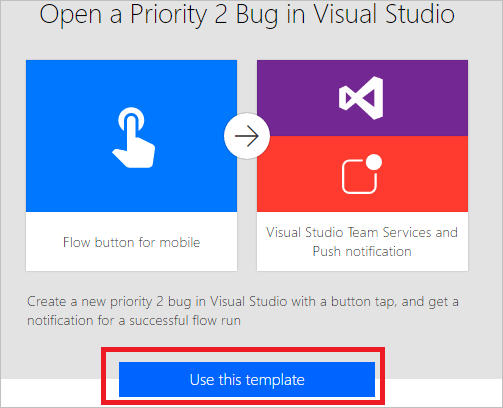

# Introdução aos fluxos de botão com entrada do usuário
[!INCLUDE [view-pending-approvals](includes/cc-rebrand.md)]
Crie um fluxo de botão para executar tarefas rotineiras simplesmente tocando em um botão. Personalize seu fluxo permitindo que o usuário forneça detalhes específicos que serão usados quando o fluxo for executado. Este tópico o orienta na criação de um fluxo de botão que usa a entrada do usuário e, em seguida, executando o fluxo de botão, destacando como fornecer a entrada do usuário.

Você pode criar um fluxo de botão no site Microsoft Flow ou no aplicativo móvel para Microsoft Flow. Para este tópico, você usará o site.

### Pré-requisitos
* Uma conta no site Microsoft Flow.

## Abrir o modelo
1. Entre no site do [Microsoft Flow](https://flow.microsoft.com), insira o **Visual Studio** na caixa de pesquisa e, em seguida, clique ou toque no ícone de pesquisa para localizar todos os modelos relacionados ao Visual Studio:
   
      
2. Selecione o modelo **abrir um bug de prioridade 2 no Visual Studio** :
   
      
3. Selecione **o botão usar este modelo** :
   
      
   
    Este modelo usa o Visual Studio Team Services (VSTS) e os serviços de notificação por push. Você precisará entrar nesses serviços se não tiver uma conexão com nenhum deles. O botão **entrar** será exibido somente se você precisar entrar em um serviço.
4. Depois de entrar em todos os serviços necessários, selecione o botão **continuar** :
   
      
5. adicional Altere o nome do fluxo digitando um nome de sua escolha na caixa na parte superior do portal:
   
    

## Personalizar a entrada do usuário
1. No cartão do gatilho, selecione **Editar**:
   
      
2. Selecione o ícone de **+** para expandir a página para que você possa adicionar campos de entrada personalizados:
   
    
3. Insira o **título de entrada** e a **Descrição de entrada** para cada campo personalizado que você deseja disponibilizar quando alguém executar o fluxo.  
   
    Neste exemplo, você criará dois campos de entrada personalizados (**etapas de reprodução de bug** e **severidade de bug**) para que qualquer pessoa que use esse fluxo possa inserir as etapas para reproduzir o bug e classificar a gravidade do bug:  
   
    

## Personalizar o bug
1. Toque na barra de título **criar um novo** cartão de item de trabalho:
   
      
2. Faça as seleções apropriadas para o ambiente do VSTS e, em seguida, selecione **Editar**:
   
    Por exemplo, conecte-se ao myinstance.visualstudio.com digitando **MyInstance**.
   
      
3. Selecione **Mostrar opções avançadas** para revelar os outros campos para este cartão:
   
      
4. Coloque o cursor antes do token do **título do bug** e digite "Severity:" no campo de texto **título** .
5. Com o cursor ainda no campo de texto título, selecione o token **severidade de bug** e, em seguida, digite "--".  
6. No campo de texto **Descrição** , coloque o cursor logo após o token de **Descrição do bug** e pressione ENTER para iniciar uma nova linha.
7. Coloque o cursor na nova linha e, em seguida, selecione o token **etapas de reprodução de bug** :
   
    

## Personalizar a notificação por push
1. Toque na barra de título no cartão **Enviar uma notificação por push** para expandi-la.
2. Na lista de tokens de conteúdo dinâmico, selecione **Ver mais**e, em seguida, adicione o token de **URL** no campo de texto **link** .
3. No campo de texto **rótulo de link** , adicione o token de **ID** :
   
      
4. Toque em **criar fluxo** no menu para criar seu fluxo:   

## Executar seu fluxo
Neste passo a passo, você usará o aplicativo móvel para Microsoft Flow executar o fluxo de botão que você acabou de criar. Você fornecerá toda a entrada do usuário necessária para criar um bug com um título, uma descrição, etapas de reprodução e um nível de severidade.  

1. No aplicativo móvel para Microsoft Flow, toque na guia **botões** e, em seguida, toque no botão **criar relatório de bugs com etapas** .
   
      
2. Insira o título para o bug que você está relatando e, em seguida, toque em **Avançar**. Por exemplo:
   
      
3. Insira a descrição do bug que você está relatando e toque em **Avançar**. Por exemplo:
   
      
4. Insira as etapas para reproduzir o bug que você está relatando e, em seguida, toque em **Avançar**. Por exemplo:
   
      
5. Insira a severidade do bug que você está relatando e, em seguida, toque em **concluído**:  
      
   
    O fluxo é executado.
6. adicional Toque na guia **atividade** para mostrar os resultados.
   
      
7. adicional Mostre os resultados detalhados da execução do fluxo tocando na etapa **criar um novo item de trabalho** .
   
    

## Usar tipos de entrada diferentes

Os fluxos de botão também podem aceitar tipos de dados avançados. Aqui está a lista de tipos de entrada de dados que os fluxos de botão aceitam: 

- Texto
- Menus suspensos (como botões de opção)
- Endereço de email
- Arquivo (por exemplo, uma foto em seu telefone)
- Sim ou não caixa de seleção
- Automática
- Data (com um seletor de calendário)

Para usar esses tipos de entrada, adicione o gatilho de **fluxo manualmente** e, em seguida, adicione qualquer um desses tipos ao seu fluxo:

Além disso, talvez você queira designar algumas entradas conforme necessário e outras como opcionais. Usar o menu de ação (... no lado direito) em cada campo de entrada. Há um limite de cinco entradas por botão.

## Próximas etapas
* [Fluxos de botão de compartilhamento](share-buttons.md)
* [Saiba mais sobre fluxos de botão](introduction-to-button-flows.md)  
* [Saiba mais sobre fluxos de botão com tokens de gatilho](introduction-to-button-trigger-tokens.md)  

