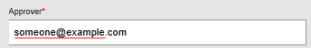
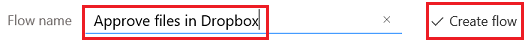

# Criar um loop de aprovação usando Microsoft Flow e o Common Data Service da Microsoft
[!INCLUDE [view-pending-approvals](includes/cc-rebrand.md)]
O Common Data Service pode fornecer uma maneira de criar fluxos que têm informações armazenadas em um banco de dados independentemente de um fluxo. O melhor exemplo disso é com as aprovações. Se você armazenar o status da aprovação em uma entidade, seu fluxo poderá trabalhar sobre ela.

Neste exemplo, você criará um processo de aprovação que é iniciado quando um usuário adiciona um arquivo ao dropbox. Quando o arquivo é adicionado, as informações sobre ele aparecem em um aplicativo, onde um revisor pode aprovar ou rejeitar a alteração. Quando o revisor aprova ou rejeita a alteração, o email de notificação é enviado e os arquivos rejeitados são excluídos do dropbox.

Seguindo as etapas nesta seção, você criará:

* uma **entidade personalizada** que conterá informações sobre cada arquivo adicionado ao dropbox e se o status do arquivo é aprovado, rejeitado ou pendente.
* um **fluxo** que adiciona informações à entidade personalizada quando um arquivo é adicionado ao dropbox, envia email quando o arquivo é aprovado ou rejeitado e exclui arquivos rejeitados. Estas etapas demonstram como criar um fluxo desse tipo do zero, mas você pode criar um fluxo semelhante de um modelo.
* um **aplicativo** no qual um revisor pode aprovar ou rejeitar arquivos adicionados ao dropbox. Você usará o PowerApps para gerar esse aplicativo automaticamente com base nos campos na entidade personalizada.

**Pré-requisitos**

* Inscreva-se para [Microsoft Flow](sign-up-sign-in.md) e [PowerApps](https://powerapps.microsoft.com/tutorials/signup-for-powerapps/).
* Crie conexões com o Dropbox e o Office 365 Outlook, como descreve [o gerenciamento de suas conexões](https://powerapps.microsoft.com/tutorials/add-manage-connections/) .

## Criar a entidade
1. Entre no [powerapps.com](https://web.powerapps.com).
2. Se a barra de navegação à esquerda não aparecer por padrão, clique ou toque no ícone com três linhas horizontais no canto superior esquerdo.
   
    
3. Na barra de navegação à esquerda, clique ou toque em **gerenciar**e, em seguida, clique ou toque em **entidades**.
   
    
4. Se solicitado, clique ou toque em **criar meu banco de dados**.
   
    
5. Próximo ao canto superior direito, clique ou toque em **nova entidade**.
   
    
   
    Se a janela do navegador não for maximizada, esse botão poderá aparecer em um local diferente.
6. Em **nome da entidade**, especifique um nome que não contenha espaços e que nenhuma outra entidade em seu banco de dados tenha.
   
    Para seguir este exemplo exatamente, especifique **ReviewDropboxFiles**.
   
    
7. Em **nome de exibição**, especifique um nome amigável.
   
    
8. Clique ou toque em **Avançar**.
   
    

## Adicionar campos à entidade
1. Próximo ao canto superior direito, clique ou toque em **Adicionar campo**.
   
    
2. Na linha em branco que aparece na parte inferior da lista de campos, defina as propriedades de um campo **Aprovador** . (Conforme você define essas propriedades, você pode alternar para a próxima coluna pressionando Tab.)
   
   * Na coluna **nome de exibição** , digite **Aprovador**.
   * Na coluna **nome** , digite **ApproverEmail**.
   * Na coluna **tipo** , clique ou toque na opção **email** .
   * Na coluna **obrigatório** , marque a caixa de seleção.
     
     
3. Na próxima linha, defina as propriedades de um campo de **status** :
   
   * Na coluna **nome de exibição** , digite **status**.
   * Na coluna **nome** , digite **status**.
   * Na coluna **tipo** , clique ou toque na opção **texto** .
   * Na coluna **Propriedades** , deixe o valor padrão.
   * Na coluna **obrigatório** , marque a caixa de seleção.
     
     
4. Na próxima linha, defina as propriedades de um campo **FileID** :
   
   * Na coluna **nome de exibição** , digite **identificador de arquivo**.
   * Na coluna **nome** , digite **FileID**.
   * Na coluna **tipo** , clique ou toque na opção **texto** .
   * Na coluna **Propriedades** , deixe o valor padrão.
   * Na coluna **exclusivo** , marque a caixa de seleção.
   * Na coluna **obrigatório** , marque a caixa de seleção.
     
     
5. Próximo à borda direita, clique ou toque nas reticências (...) para o campo **FileID** e, em seguida, clique ou toque em **definir como campo título**.
   
    
6. Próximo ao canto inferior esquerdo, clique ou toque em **criar**.
   
    
7. adicional Quando a lista de entidades reaparecer, maximize a janela do navegador se ela ainda não estiver maximizada e, em seguida, clique ou toque no cabeçalho da coluna **tipo** . A lista é classificada com as entidades personalizadas, como aquela que você acabou de criar, aparecendo na parte superior.

## Entrar e criar um fluxo
1. Abra o [portal de Microsoft Flow](https://flow.microsoft.com).
2. Maximize a janela do navegador se ela ainda não estiver maximizada e, em seguida, clique ou toque em **entrar** perto do canto superior direito.
   
    
3. No menu superior direito, selecione o ambiente no qual você criou o banco de dados em powerapps.com.
   
    **Observação**: se você não selecionar o mesmo ambiente, você não verá sua entidade.
4. Próximo ao canto superior esquerdo, clique ou toque em **meus fluxos**.
   
    
5. Próximo ao canto superior direito, clique ou toque em **criar novo fluxo**.
   
    

## Iniciar quando um arquivo for adicionado
1. Na caixa que contém **Pesquisar mais gatilhos**, digite ou cole **Dropbox**e, em seguida, clique ou toque em **Dropbox – quando um arquivo é criado**.
   
    
2. Em **pasta**, clique ou toque no ícone de pasta e, em seguida, navegue até a pasta onde os arquivos serão adicionados.
   
    

## Adicionar dados à entidade
1. Clique ou toque em **nova etapa**e, em seguida, clique ou toque em **Adicionar uma ação**.
   
    
2. Na caixa que contém **Pesquisar mais ações**, digite ou cole **Common Data Service**e, em seguida, clique ou toque em **Common Data Service-criar objeto**.
   
    
3. Na **entidade**, digite ou cole **revisão**e, em seguida, clique ou toque em **examinar arquivos do Dropbox**.
   
    
4. Em **título**, clique ou toque na caixa e, em seguida, clique ou toque em **nome do arquivo** na lista de tokens de parâmetro para adicionar esse token ao campo.
   
    
5. Em **Aprovador**, digite ou cole o endereço de email da pessoa que irá revisar os arquivos.
   
    **Observação**: para facilitar o teste do fluxo, especifique seu próprio endereço. Você pode alterá-lo mais tarde, quando o fluxo estiver pronto para uso real.
   
    
6. Em **status**, digite ou cole **pendente**.
   
    
7. Em **identificador de arquivo**, clique ou toque na caixa e, em seguida, clique ou toque em **identificador de arquivo** na lista de tokens de parâmetro para adicionar esse token ao campo.
   
    

## Verifique se o arquivo foi revisado
1. Na ação **criar objeto** , clique ou toque em **nova etapa**, clique ou toque em **mais**e, em seguida, clique ou toque em **Adicionar um do until**.
   
    
2. No canto superior esquerdo da ação do **until** , clique ou toque na caixa que contém **escolher um valor**.
   
    
   
    **Observação**: se a janela do navegador não for maximizada, clique ou toque na caixa superior que contém **escolher um valor**.
3. Em **saídas de criar objeto**, clique ou toque em **status** para adicionar esse token de parâmetro ao campo.
   
    
4. Abra a lista próxima ao centro da ação do **until** e, em seguida, clique ou toque em **não é igual a**.
   
    
5. No canto superior direito da ação do **until** , digite ou cole **pendente** na caixa que contém **escolher um valor**.
   
    
   
    **Observação**: se a janela do navegador não for maximizada, clique ou toque na caixa inferior que contém **escolher um valor**.
6. Próximo à parte inferior da ação do **until** , clique ou toque em **Adicionar uma ação**.
   
    
7. Na caixa que contém **Pesquisar mais ações**, digite **comum**e, em seguida, clique ou toque em **Common Data Service-obter objeto**.
   
    
8. No **namespace**, clique ou toque em seu banco de dados.
9. Na **entidade**, digite ou cole **revisão**e, em seguida, clique ou toque em **examinar arquivos do Dropbox**.
   
    
10. Em **ID de objeto**, clique ou toque na caixa e, em seguida, clique ou toque no token de parâmetro **identificador de arquivo** para adicioná-lo ao campo.
    
     

## Verificar se o item foi aprovado
1. Na ação **do-until** , clique ou toque em **nova etapa**e, em seguida, clique ou toque em **Adicionar uma condição**.
   
    
2. No canto superior esquerdo da condição, clique ou toque na caixa que contém **escolher um valor**.
   
    
   
    **Observação**: se a janela do navegador não for maximizada, clique ou toque na caixa superior que contém **escolher um valor**.
3. Em **saídas de obter objeto**, clique ou toque no token de parâmetro de **status** para adicioná-lo ao campo.
   
    
4. No canto superior direito da condição, digite ou cole **aprovado** na caixa que contém **escolher um valor**.
   
    
   
    **Observação**: se a janela do navegador não for maximizada, digite ou cole **aprovado** na caixa inferior que contém **escolher um valor**.

## Enviar email de notificação
1. Em **se Sim, não faça nada**, clique ou toque em **Adicionar uma ação**.
   
    
2. Na caixa que contém **Pesquisar mais ações**, digite ou cole **Enviar email**e, em seguida, clique ou toque em **Office 365 Outlook-enviar um email**.
   
    
3. Em **para**, digite ou cole o endereço da pessoa que você deseja notificar quando um item for aceito.
   
    **Observação**: para facilitar o teste do fluxo, especifique seu próprio endereço. Você pode alterá-lo quando o fluxo estiver pronto para uso real.
   
    
4. Em **assunto**, clique ou toque na caixa e, em seguida, clique ou toque no token de parâmetro **nome do arquivo** para adicioná-lo ao campo.
   
    
5. Em **corpo**, digite ou cole **o item foi aprovado.**
   
    
6. Em **se não, não faça nada**, repita as etapas de 1-5 neste procedimento, exceto especificar o corpo da mensagem de email, pois **o item foi rejeitado.**
   
    

## Excluir arquivos rejeitados
1. Nos campos do email de rejeição, clique ou toque em **Adicionar uma ação**.
   
    
2. Na caixa que contém **Pesquisar mais ações**, digite ou cole **Dropbox**e, em seguida, clique ou toque em **Dropbox-excluir arquivo**.
   
    
3. Em **arquivo**, clique ou toque na caixa e, em seguida, clique ou toque no parâmetro **identificador do arquivo** token para adicioná-lo ao campo.
   
    

## Salvar o fluxo
1. Na parte superior da tela, digite ou cole um nome para o fluxo que você está criando e, em seguida, clique ou toque em **criar fluxo**.
   
    
2. Clique ou toque em **fechar** e, em seguida, clique ou toque em **concluído**.
3. No Dropbox, adicione pelo menos dois arquivos à pasta que você especificou: um para testar a aprovação e outro para testar a rejeição.

## compilar o aplicativo
1. Entre no [powerapps.com](https://web.powerapps.com)e, em seguida, clique ou toque em **novo aplicativo** próximo à parte inferior da barra de navegação à esquerda.
   
    
2. Na caixa de diálogo que aparece, clique ou toque na opção para abrir um PowerApps Studio para Windows ou PowerApps Studio para a Web.
3. Se você abriu PowerApps Studio para Windows, clique ou toque em **novo** na barra de navegação à esquerda.
4. Em **criar um aplicativo com base em seus dados**, clique ou toque em **layout de telefone** no bloco **Common Data Service** .
   
    
5. Na caixa de **pesquisa** , digite ou cole **revisão**.
   
    
6. Em **escolher uma entidade**, clique ou toque em **examinar arquivos do Dropbox**.
   
    
7. Próximo ao canto inferior direito, clique ou toque em **conectar**.
   
    
8. Se a tela de abertura do Tour de introdução for exibida, faça o Tour para se familiarizar com o PowerApps (ou clique ou toque em **ignorar**).
   
    
   
    Você sempre pode fazer o Tour mais tarde clicando ou tocando no ícone de ponto de interrogação próximo ao canto superior esquerdo e, em seguida, clicando ou tocando em **fazer o Tour de introdução**.
9. adicional Próximo à parte inferior da tela, arraste o controle deslizante para aumentar o zoom para que o aplicativo fique mais fácil de ver.
   
    

## Personalizar o aplicativo
1. Na barra de navegação à direita, clique ou toque no layout que inclui um cabeçalho e uma descrição.
   
    
2. No **BrowseScreen**, clique ou toque apenas na barra de pesquisa para selecionar o controle de caixa de texto maior.
   
    
3. No painel à direita, abra a lista inferior clicando ou tocando na seta para baixo.
   
    
4. Na lista inferior, clique ou toque em **título** para mostrar o nome do arquivo dos arquivos adicionados.
   
    
5. No painel direito, abra a lista superior e, em seguida, clique ou toque em **status** para mostrar o status de cada arquivo.
   
    

## Testar a solução geral
1. No PowerApps, abra o modo de visualização clicando ou tocando no botão reproduzir próximo ao canto superior esquerdo.
   
    
2. Para o primeiro arquivo na lista, clique ou toque na seta para mostrar os detalhes sobre esse arquivo.
   
    
3. No canto superior direito, clique ou toque no ícone de lápis para alterar os detalhes sobre o arquivo.
   
    
4. Na caixa **status** , digite ou cole **aprovado**.
   
    
5. No canto superior direito, clique ou toque no ícone de marca de seleção para salvar as alterações e retornar à tela de detalhes.
   
    
   
    Em alguns minutos, você receberá um email informando que o arquivo foi aprovado.
6. No canto superior direito, clique ou toque no botão voltar para retornar à tela de navegação.
   
    
7. Para o outro arquivo na lista, clique ou toque na seta para mostrar os detalhes sobre esse arquivo.
   
    
8. No canto superior direito, clique ou toque no ícone de lápis para alterar os detalhes sobre o arquivo.
   
    
9. Na caixa **status** , digite ou cole **rejeitado** (ou qualquer coisa, exceto **aprovada**, incluindo **aprovado** ou **aprovado**).
   
    
10. No canto superior direito, clique ou toque no ícone de marca de seleção para salvar as alterações e retornar à tela de detalhes.
    
     
    
     Em alguns minutos, você receberá um email informando que o arquivo foi rejeitado e o arquivo será excluído do dropbox.

