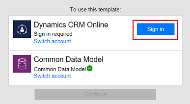

# Criar um fluxo que usa o Common Data Service
[!INCLUDE [view-pending-approvals](includes/cc-rebrand.md)]
Melhore a eficiência operacional com uma exibição unificada de dados corporativos criando um fluxo que usa o [Common Data Service](https://powerapps.microsoft.com/tutorials/data-platform-intro/). Implante esse banco de dados de negócios seguro que compreende entidades comerciais padrão bem formadas (como vendas, compras, atendimento ao cliente e produtividade) em sua organização. Armazene dados organizacionais em uma ou mais [entidades personalizadas](https://powerapps.microsoft.com/tutorials/data-platform-create-entity/), que oferecem vários benefícios em relação a fontes de dados externas, como o Microsoft Excel e o Salesforce.

Por exemplo, aproveite o Common Data Service em Microsoft Flow dessas principais maneiras:

* Crie um fluxo para importar dados, exportar dados ou tomar medidas sobre os dados (como enviar uma notificação). Observe que essa abordagem não é um serviço de sincronização completo; Ele simplesmente permite que você mova dados para dentro ou para fora de acordo com a entidade.
  
    Para obter etapas detalhadas, consulte os procedimentos mais adiante neste tópico.
* Em vez de [criar um loop de aprovação por email](wait-for-approvals.md), crie um fluxo que armazene o estado de aprovação em uma entidade e crie um aplicativo personalizado no qual os usuários possam aprovar ou rejeitar itens.
  
    Para obter etapas detalhadas, consulte [criar um loop de aprovação com o Common Data Service](common-data-model-approve.md).

**Pré-requisitos**

* Inscreva-se para [Microsoft Flow](https://flow.microsoft.com) e [PowerApps](https://web.powerapps.com).
  
    Se você tiver problemas, verifique se [Microsoft Flow](sign-up-sign-in.md) e [PowerApps](https://powerapps.microsoft.com/tutorials/signup-for-powerapps/) dão suporte ao tipo de conta que você tem e sua organização não bloqueou a inscrição.
* Se você não tiver usado o Common Data Service antes, abra a guia **entidades** de [powerapps.com](https://web.powerapps.com/#/entities)e, em seguida, clique ou toque em **criar meu banco de dados**.

## Entre no seu ambiente
1. Abra o [portal de Microsoft Flow](https://flow.microsoft.com)e, em seguida, clique ou toque em **entrar** no canto superior direito.
   
    **Observação**: Talvez seja necessário abrir o menu superior esquerdo para mostrar o botão **entrar** .
   
    
2. No menu superior direito, selecione o ambiente no qual você criou o banco de dados em powerapps.com.
   
    **Observação**: se você não selecionar o mesmo ambiente, você não verá suas entidades.
   
    

## Abrir um modelo
1. Na caixa **Pesquisar modelos** na parte superior da tela, digite ou cole **comum**e pressione Enter.
   
    
2. Na lista de modelos, clique ou toque no modelo que importa os dados da origem que você deseja para a entidade (ou *objeto*) que você deseja.
   
    Por exemplo, clique ou toque no modelo que copia as informações de contato do Dynamics 365 para a Common Data Service.
   
    
3. Clique ou toque em **usar este modelo**.
   
    
4. Se você ainda não criou uma conexão de Microsoft Flow para o Dynamics 365, clique ou toque em **entrar**e, em seguida, forneça suas credenciais, se solicitado.
   
    
5. Clique ou toque em **continuar**.
   
    

## Crie seu fluxo
1. No primeiro cartão, especifique o evento que irá disparar o fluxo.
   
    Por exemplo, você está criando um fluxo que irá copiar novos contatos de uma instância do Dynamics 365 para o Common Data Service. Em **quando um registro é criado**, especifique a instância clicando ou tocando na seta para baixo e, em seguida, clicando ou tocando em uma opção na lista que aparece.
   
    
2. adicional Próximo à parte superior da tela, especifique um nome diferente para o fluxo que você está criando.
   
    **Observação**: se a janela do navegador não for maximizada, a interface do usuário poderá parecer um pouco diferente.
   
    
3. Clique ou toque em **criar fluxo**.
   
    **Observação**: se a janela do navegador não for maximizada, somente a marca de seleção poderá ser exibida.
   
    

Agora, sempre que esse objeto for criado no sistema de origem, ele será importado para o Common Data Service. Se você não encontrar um modelo que faça o que precisa, poderá [criar um fluxo do zero](get-started-logic-flow.md) que opere sobre o Common Data Service.

Você pode executar ações sobre alterações no banco de dados. Por exemplo, você pode enviar email de notificação sempre que os dados forem alterados.

