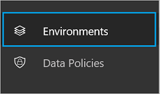

# Usando ambientes dentro de Microsoft Flow
[!INCLUDE [view-pending-approvals](includes/cc-rebrand.md)]

## Benefícios

Os ambientes oferecem os seguintes benefícios:

* **Localidade dos dados: os**ambientes podem ser criados em regiões diferentes e estão associados a esse local geográfico. Quando você cria um fluxo em um ambiente, esse fluxo é roteado para todos os data centers nesse local geográfico. Isso também fornece um benefício de desempenho.

    Se os usuários estiverem na Europa, crie e use o ambiente na região da Europa. Se os usuários estiverem na Estados Unidos, crie e use o ambiente nos EUA. 

    > [!IMPORTANT]
    > Se você excluir o ambiente, todos os fluxos dentro desse ambiente também serão excluídos. Isso se aplica a todos os itens que você criar no ambiente, incluindo conexões, gateways, PowerApps e muito mais.
* **Prevenção de perda de dados**: como administrador, você não deseja que os fluxos obtenham dados de um local interno (como o *onedrive for Business* ou uma lista do SharePoint que contenha informações de salário) e, em seguida, poste esses dados publicamente (por exemplo, para  *Twitter*). Use a prevenção de perda de dados para controlar quais serviços podem compartilhar dados dentro de sua implantação de Microsoft Flow.

    Por exemplo, você pode adicionar o *SharePoint* e o *onedrive for Business* Services a uma política somente de dados de negócios. Todos os fluxos criados nesse ambiente podem usar o *SharePoint* e o *onedrive for Business* Services. No entanto, eles não poderão compartilhar dados com outros serviços que não estão incluídos na política de somente dados de negócios.

  > [!NOTE]
  > A prevenção de perda de dados está disponível com algumas SKUs de licença, incluindo a licença P2.

* **Limite de isolamento para todos os recursos**: quaisquer fluxos, gateways, conexões, conectores personalizados e assim por diante residem em um ambiente específico. Eles não existem em nenhum outro ambiente.
* **Common Data Service**: aqui estão suas opções se você quiser criar um fluxo que insere dados em um serviço:

  * Insira dados em um arquivo do Excel e armazene o arquivo do Excel em uma conta de armazenamento em nuvem, como o OneDrive.
  * Criar um banco de dados SQL e, em seguida, armazená-los nele.
  * Use o Common Data Service para armazenar seus dados.

    Cada ambiente pode ter um máximo de um banco de dados para seus fluxos na Common Data Service. O acesso ao Common Data Service depende da licença que você comprou; o Common Data Service não está incluído com a licença gratuita.

## Limitações

Embora os ambientes ofereçam muitos benefícios, eles também apresentam novas limitações. O fato de que os ambientes são um limite de isolamento significa que você nunca pode ter recursos que referenciem recursos *entre* ambientes. Por exemplo, você não pode criar um conector personalizado em um ambiente e, em seguida, criar um fluxo que usa esse conector personalizado em um ambiente diferente.

## Usar o ambiente padrão

O ambiente **padrão** é compartilhado por todos os usuários e qualquer usuário pode criar fluxos no ambiente **padrão** .

> [!TIP]
> Se você for um usuário de visualização, todos os fluxos existentes residirão no ambiente padrão. Um *usuário de visualização* é alguém que estava usando Microsoft Flow antes de sua liberação para disponibilidade geral (GA).

## O centro de administração

Os administradores usam o centro de administração para criar e gerenciar ambientes. Aqui estão as duas maneiras de abrir o centro de administração:

### Opção 1: selecione as configurações

1. Entre no [Flow.Microsoft.com](https://flow.microsoft.com).
1. Selecione a engrenagem configurações e escolha **centro de administração** na lista:

   
1. O centro de administradores é aberto.

### Opção 2: abrir admin.flow.microsoft.com

Acesse [admin.Flow.Microsoft.com](https://admin.flow.microsoft.com)e entre com sua conta corporativa.

## Criar um ambiente

1. No [centro de administração do Microsoft Flow](https://admin.flow.microsoft.com), selecione **ambientes**. Você verá todos os ambientes existentes: 
2. Selecione **novo ambiente** e forneça as informações necessárias:

   |     Propriedade     |                                                 Ndescrição                                                 |
   |------------------|-------------------------------------------------------------------------------------------------------------|
   | Nome do ambiente |              Insira o nome do seu ambiente, como `Human Resources`ou `Europe flows`.              |
   |      Regionais      | Escolha o local para hospedar seu ambiente. Para obter o melhor desempenho, use uma região mais próxima de seus usuários. |
   | Tipo de ambiente |                  Escolha um tipo de ambiente com base na sua licença: produção ou avaliação.                   |

     
3. Clique em **criar ambiente**.
4. Agora você tem uma opção para **criar o banco de dados** ou **ignorar**.
5. Se você optar por **criar o banco de dados**, será solicitada uma **moeda** e um **idioma** para o banco de dados. Além disso, você também pode optar por ter aplicativos de exemplo e dados implantados.

   

Agora você pode adicionar usuários ao ambiente.

## Gerenciar seus ambientes existentes

1. No [centro de administração do Microsoft Flow](https://admin.flow.microsoft.com), selecione **ambientes**:

   
1. Selecione um ambiente para abrir suas propriedades.
1. Use a guia **detalhes** para exibir informações adicionais sobre um ambiente, incluindo quem criou o ambiente, sua localização geográfica e muito mais:

   
1. Selecione **segurança**.

    Se você não selecionou **criar banco de dados** nas etapas anteriores, em **funções de ambiente**, há duas opções: **administrador de ambiente** e criador de **ambiente**:

    

    Um **criador** pode criar novos recursos, como fluxos, conexões de dados e gateways em um ambiente.

   > [!NOTE]
   > Um usuário não precisa ser um **criador** para *Editar* recursos em um ambiente. Cada criador determina quem pode editar seus recursos concedendo permissões a usuários que não são criadores de ambiente.
   > 
   > 

    Um **administrador** pode criar políticas de prevenção contra perda de dados e executar outras tarefas administrativas, como criar ambientes, adicionar usuários a ambientes e atribuir privilégios de administrador/criador.

   1. Selecione a função **criador de ambiente** e selecione **usuários**: função do 
   1. Insira um nome, endereço de email ou grupo de usuários que você gostaria de fornecer à função de **criador** .
   1. Selecione **salvar**.

1. Em **segurança**, selecione **funções de usuário**:

    

    Todas as funções existentes são listadas, incluindo as opções para editar ou excluir a função.

    Selecione **nova função** para criar uma nova função.
1. Em **segurança**, selecione **conjuntos de permissões**:

    

    Você verá todos os conjuntos de permissões e opções existentes para editar ou excluir funções.

    Selecione **novo conjunto de permissões** para criar um novo conjunto de permissões.
1. Se você tiver optado por **criar o banco**de dados, para armazená-los, ele será parte do Common Data Service. Quando você clicar na guia **segurança** , será solicitado que você navegue até o centro de **Gerenciamento de instância do Dynamics 365** em que a segurança baseada em função pode ser aplicada.

1. Selecione o usuário na lista de usuários no ambiente/instância.
  

1. Atribua a função ao usuário.

   

> [!NOTE]
> Os usuários ou grupos atribuídos a essas funções de ambiente não recebem automaticamente o acesso ao banco de dados do ambiente (se existir) e devem receber acesso separadamente por um proprietário de banco de dados. 
>
>

### Segurança do banco de dados
A capacidade de criar e modificar um esquema de banco de dados e de conectar-se com os que são armazenados em um banco de dado que é provisionado em seu ambiente é controlada pelas funções de usuário do banco de dados e pelos conjuntos de permissões. Você pode gerenciar as funções de usuário e os conjuntos de permissões para o banco de dados do seu ambiente na seção **funções de usuário** e **conjuntos de permissões** da guia **segurança** . 

   

## Perguntas frequentes

### Posso mover um fluxo entre ambientes?

Sim, os fluxos podem ser exportados de um ambiente e importados para outro ambiente.

### Qual licença inclui o Common Data Service?

Somente Microsoft PowerApps plano 2 inclui direitos para criar bancos de dados com o Common Data Service. No entanto, todos os planos pagos (Microsoft Flow planos 1 e 2 e Microsoft PowerApps planos 1 e 2) têm os direitos de usar o Common Data Service.

Escolha um plano adequado para você visitando a página de [preços do Microsoft Flow](https://flow.microsoft.com/pricing/) .

Consulte o documento [perguntas de cobrança](billing-questions.md) para obter respostas para perguntas frequentes sobre cobrança.

### O Common Data Service pode ser usado fora de um ambiente?

Não. O Common Data Service requer um ambiente. [Leia mais](common-data-model-intro.md) sobre isso.

### Quais regiões incluem Microsoft Flow?

Microsoft Flow oferece suporte à maioria das regiões às quais o Office 365 dá suporte, consulte [a visão geral de regiões](regions-overview.md) para obter mais detalhes.

### O que é necessário para criar meu próprio ambiente personalizado?

Todos os usuários com a licença do Microsoft Flow plano 2 podem criar seus próprios ambientes. Todos os Microsoft Flow usuários podem usar ambientes criados por administradores do plano 2, mas não podem criar seus próprios ambientes.
