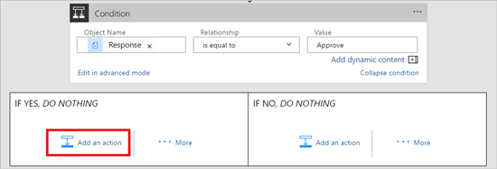

1. Selecione **Adicionar uma ação**, no branch da condição **SE SIM**.
   
    
2. Insira **enviar email** na caixa de pesquisa no cartão **Escolher uma ação**.
   
    
3. Selecione a ação **Outlook do Office 365 - Enviar um email**:
   
    
4. Configure o cartão de email para atender às suas necessidades.
   
     >[!NOTE]
     > **Para**, **Assunto** e **Corpo** são necessários.
     >
     >
   
     Este cartão é um modelo para o email que é enviado quando o status das solicitações de férias for alterado.
   
     Observação: na caixa **Corpo**, no cartão **Enviar um email**, use o token **Comentários** da ação **Aprovações – iniciar uma aprovação**.

