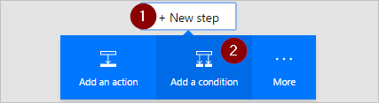

1. Selecione **Nova etapa** e **Adicionar uma condição**.
   
    
2. Selecione a caixa **Nome do Objeto** e, em seguida, insira **resposta** na caixa de pesquisa no cartão **Adicionar conteúdo dinâmico a partir de aplicativos e serviços usados neste fluxo**.
3. Selecione o token **Resposta**.
   
    
4. Selecione a caixa **Valor** e, em seguida, insira **Aprovar** na caixa.
   
   > [!NOTE]
   > As respostas válidas para a ação **Aprovações - Iniciar uma aprovação** são "Aprovar" e "Rejeitar". Essas respostas diferenciam maiúsculas de minúsculas.
   > 
   > 
5. Seu cartão de **Condição** agora deve ser semelhante a esta imagem:
   
    

