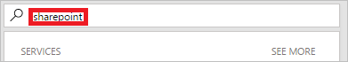

1. Digite **SharePoint** na caixa de pesquisa.
   
    
2. Localize e selecione o gatilho **SharePoint – Quando um novo item é criado**.
   
    
3. Selecione o **Endereço do Site** e o **Nome da Lista** para a lista do SharePoint que seu fluxo monitora para novos itens.

