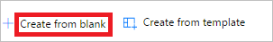

1. Entre no [Microsoft Flow](https://flow.microsoft.com).
   
    
2. Selecione a guia **Meus fluxos**.
   
    
3. Selecione **Criar do zero**.
   
    

4. Selecione o botão **Criar de um modelo em branco**.

