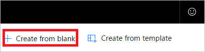

1. Entre no [Microsoft Flow](https://flow.microsoft.com) e selecione a guia **Meus fluxos**.
2. Selecione **Criar do zero**.
   
    
3. Procure por "email" e, em seguida, selecione **Outlook do Office 365 - Quando um novo email chega** da lista de gatilhos. Esse gatilho é executado sempre que um email chega.
   
    

