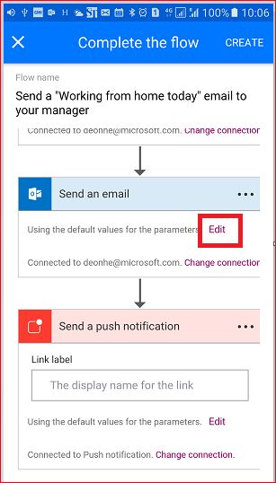
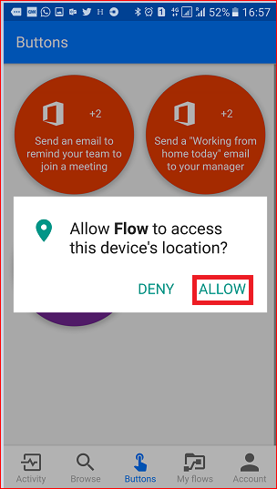

# Introdução aos tokens de gatilho de botão
[!INCLUDE [view-pending-approvals](includes/cc-rebrand.md)]
## O que são tokens de gatilho de botão?
Tokens de gatilho de botão são pontos de dados que são conhecidos e estão disponíveis para o dispositivo no qual um [fluxo de botão](introduction-to-button-flows.md) está em execução. Esses tokens são alterados com base em fatores como a hora atual ou a localização geográfica do dispositivo em um determinado momento.  

Por exemplo, se você estiver executando um fluxo de botão em um telefone inteligente, é provável que o **telefone saiba a hora** em seu local atual, bem como a data e o endereço atual. Nesse contexto, a hora, a data e o endereço onde o telefone está localizado são todos determinados no momento em que o fluxo de botão é executado. Eles ficam automaticamente disponíveis para uso em qualquer fluxo de botão executado no dispositivo. Você pode usar esses tokens de gatilho para criar fluxos úteis que minimizarão tarefas repetitivas, como fornecer seu local para alguém ou controlar quanto tempo você gastou em uma chamada de trabalho/serviço específica.

### Lista de tokens de gatilho de botão
Aqui está a lista de tokens de gatilho de botão que estão disponíveis para uso durante a criação de fluxos de botão.

| Meter | Ndescrição |
| --- | --- |
| Azul |A cidade em que o dispositivo que está executando o fluxo está localizado. |
| País/região |O país/região no qual o dispositivo que está executando o fluxo está localizado. |
| Endereço completo |O endereço completo em que o dispositivo que está executando o fluxo está localizado. |
| Latitude |A latitude na qual o dispositivo que está executando o fluxo está localizado. |
| Longitude |A longitude na qual o dispositivo que está executando o fluxo está localizado. |
| PostalCode |O CEP no qual o dispositivo que está executando o fluxo está localizado. |
| Status |O estado em que o dispositivo que está executando o fluxo está localizado. |
| Endereço |A rua em que o dispositivo que está executando o fluxo está localizado. |
| estampa |A hora na área em que o dispositivo que está executando o fluxo está localizado. |
| Date |A data na área em que o dispositivo que está executando o fluxo está localizado. |
| Nome de usuário |O nome de usuário da pessoa que entrou no dispositivo que está executando o fluxo. |
| Email do usuário |O endereço de email da pessoa que entrou no dispositivo que está executando o fluxo. |

## Criar um fluxo de botão que usa tokens de gatilho
Ao criar um botão, você pode usar tokens de gatilho para adicionar funcionalidade avançada ao seu botão.

Neste passo a passo, criaremos um fluxo de botão em um dispositivo Android. O fluxo de botão usará tokens de gatilho para enviar a data e seu endereço completo em um email "**trabalhando de casa**" para seu chefe.

Neste passo a passo, você verá capturas de tela de um dispositivo Android, no entanto, a experiência é semelhante em dispositivos iOS e Windows Phone também.

### Pré-requisitos
* Um endereço de email corporativo ou de estudante ou uma [conta da Microsoft](https://account.microsoft.com/about?refd=www.microsoft.com) com acesso a Microsoft Flow.
* O aplicativo móvel Microsoft Flow para [Android](https://aka.ms/flowmobiledocsandroid), [Ios](https://aka.ms/flowmobiledocsios)ou [Windows Phone](https://aka.ms/flowmobilewindows).

Vamos começar:

1. Inicie o Flow e selecione **procurar**   
   token de gatilho de botão de   
2. Selecione o **email enviar um "trabalhando de casa hoje" para seu** serviço de gerente na categoria de **botão**   
   token de gatilho de botão de   
3. Selecione **usar este modelo**  
   token de gatilho de botão de   
4. Selecione **Editar** no cartão **enviar um email**  
   token de gatilho de botão de   
5. Toque na caixa de texto **assunto** e digite: " **Today-** " na caixa de texto após o texto "casa". Observe que, quando você tocou na caixa de texto, uma lista de parâmetros/tokens também é aberta. Usaremos um desses tokens na próxima etapa para adicionar a data ao assunto do email.  
   token de gatilho de botão de   
6. Com o cursor ainda na caixa de texto assunto, role até a lista **manual** de parâmetros e toque em **Data**. Observe que o parâmetro date agora está na caixa de texto **Subject** :  
   token de gatilho de botão de   
7. Role até a caixa de texto **corpo** e toque depois da mensagem padrão para que os tokens adicionais possam ser incluídos lá.  
   token de gatilho de botão de   
8. Toque no parâmetro **endereço completo** e, em seguida, toque em **criar**  
   token de gatilho de botão de   
9. Toque em **concluído**. O fluxo de botão agora é criado.  
   token de gatilho de botão de   

## Executar o fluxo de botão
**Observação**: esse fluxo de botão enviará seu local atual por email.  

1. Toque na categoria **botões** na parte inferior da tela. Você verá uma lista dos botões que você tem permissões para usar. Toque no botão que representa o fluxo de botão que você acabou de criar:  
   token de gatilho de botão de   
2. Toque em **permitir** para indicar que está OK para o fluxo de botão acessar as informações de local do seu dispositivo:  
   token de gatilho de botão de   
3. Em alguns instantes, observe que o email foi enviado para seu chefe:  
     

Parabéns, você acabou de criar um fluxo de botão que usa os tokens de gatilho de data e de endereço completo. 

## Próximas etapas
* [Fluxos de botão de compartilhamento](share-buttons.md)
* [Saiba mais sobre fluxos de botão](introduction-to-button-flows.md)
