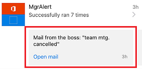

# Monitorar a atividade em Microsoft Flow do seu telefone
[!INCLUDE [view-pending-approvals](includes/cc-rebrand.md)]
Exiba um resumo de quantas vezes cada fluxo teve êxito ou falhou hoje, ontem e dias anteriores. Explore os detalhes sobre cada execução, como quando ele foi executado, quanto tempo cada etapa levou e, se houve falha, por quê.

**Pré-requisitos**

<iframe width="560" height="315" src="https://www.youtube.com/embed/vZuYZ64K3tI?list=PL8nfc9haGeb55I9wL9QnWyHp3ctU2_ThF" frameborder="0" allowfullscreen></iframe>

* Instale o aplicativo móvel Microsoft Flow para [Android](https://aka.ms/flowmobiledocsandroid), [Ios](https://aka.ms/flowmobiledocsios)ou [Windows Phone](https://aka.ms/flowmobilewindows) em um [dispositivo com suporte](getting-started.md#use-the-mobile-app). Os gráficos neste tópico refletem a versão do aplicativo para iPhone, mas os elementos gráficos no Android e Windows Phone são semelhantes.
* Se você ainda não tiver um fluxo, crie um no [site para Microsoft Flow](https://flow.microsoft.com/). Para um teste mais fácil, use um que possa ser disparado em vez de aguardar um evento externo.

O fluxo neste tutorial é executado quando você recebe o email de um endereço específico:

Você pode configurar um fluxo desse tipo com seu endereço de email pessoal para teste e um endereço diferente (por exemplo, o seu gerente) quando o fluxo estiver pronto para uso real.

Quando o fluxo é executado, ele envia uma notificação por push personalizada, com essa sintaxe, ao seu telefone:

**Observação:** Você também pode [gerenciar seus fluxos](mobile-manage-flows.md) do aplicativo móvel.

## Exibir um resumo da atividade
<iframe width="560" height="315" src="https://www.youtube.com/embed/nVCGJamOw6s?list=PL8nfc9haGeb55I9wL9QnWyHp3ctU2_ThF" frameborder="0" allowfullscreen></iframe>

1. Se o fluxo não for executado antes, dispare uma execução para gerar dados.
   
    Pode levar algum tempo para que os dados apareçam no aplicativo.
2. Abra o aplicativo móvel, que mostra a guia **atividade** por padrão.
   
    Essa guia organiza os dados por dia, com os dados atuais na parte superior.
   
    
   
    Cada entrada mostra o nome de um fluxo com ícones que correspondem a seus eventos de gatilho e ações.
   
    
   
    Se pelo menos uma execução de um fluxo tiver sido bem-sucedida em um dia, uma entrada mostrará o número de sucessos e a hora em que foi bem-sucedida mais recentemente. Uma entrada diferente mostra informações semelhantes se um fluxo falhou.
   
    
   
    Se um fluxo envia uma notificação por push, o texto da notificação mais recente é exibido na parte inferior da entrada para execuções bem-sucedidas.
   
    
3. Se várias notificações por push forem enviadas em um dia, passe o dedo para a esquerda na notificação para exibir notificações de até três execuções anteriores. Se mais de quatro notificações forem enviadas em um dia, passe o dedo para a esquerda até **Ver mais** aparecer e, em seguida, toque nele para exibir uma lista de todas as notificações.
   
    
4. Toque em **voltar** para retornar ao resumo da atividade.
5. Para filtrar o resumo da atividade, toque no ícone no canto superior direito.
   
    Você pode mostrar todas as entradas, apenas as entradas de falha ou apenas as entradas que incluem notificações por push.
   
    

## Mostrar detalhes de uma execução
1. No resumo da atividade, toque em uma entrada para mostrar os detalhes da execução mais recente.
   
     Cada evento e ação aparece com um ícone que indica se o evento ou a ação teve êxito ou falhou. Se tiver êxito, a quantidade de tempo que levou (em segundos) também será exibida.
   
    
2. Na parte inferior da tela, toque em **Ver execuções anteriores** para listar todas as execuções do fluxo e, em seguida, toque em uma execução para mostrar seus detalhes.
   
    

