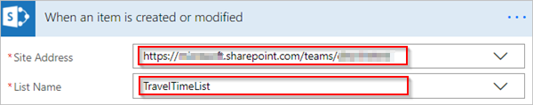
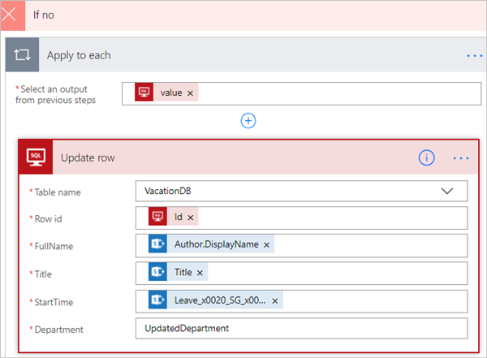

# Filtrar e copiar dados com Microsoft Flow
[!INCLUDE [view-pending-approvals](includes/cc-rebrand.md)]
Este tutorial mostra como criar um fluxo que monitora uma fonte de itens novos ou alterados e, em seguida, copia essas alterações para um destino. Você pode criar um fluxo como este se os usuários inserem dados em um local, mas sua equipe precisa dele em um local ou formato diferente.

Embora este passo a passos Copie dados de uma [lista](https://support.office.com/article/SharePoint-lists-I-An-introduction-f11cd5fe-bc87-4f9e-9bfe-bbd87a22a194) do Microsoft SharePoint (a origem) para uma tabela do banco de dado [SQL do Azure](https://docs.microsoft.com/azure/sql-database/sql-database-technical-overview) (o destino), você pode copiar dados entre qualquer um dos mais de [150 serviços](https://flow.microsoft.com/connectors/) aos quais Microsoft Flow dá suporte.

> [!IMPORTANT]
> As alterações feitas no destino não são copiadas para a origem porque não há suporte para sincronizações bidirecionais. Se você tentar configurar uma sincronização bidirecional, criará um loop infinito onde as alterações são enviadas indefinidamente entre a origem e o destino.
> 
> 

## Pré-requisitos
* Acesso a uma fonte de dados e um destino. Este passo a passos não inclui etapas para criar a origem e o destino.
* Acesso a [Microsoft Flow](https://flow.microsoft.com).
* Uma compreensão básica de como os dados são armazenados.
* Familiaridade com as noções básicas de criação de fluxos. Você pode examinar como adicionar [ações, gatilhos](multi-step-logic-flow.md#add-another-action)e [condições](add-condition.md). As etapas a seguir pressupõem que você saiba como executar essas ações.

> [!TIP]
> Cada nome de coluna na origem e no destino não precisa corresponder, mas você deve fornecer dados para todas as colunas *necessárias* ao inserir ou atualizar um item. Microsoft Flow identifica os campos obrigatórios para você.
> 
> 

## Visão geral rápida das etapas
Se você estiver familiarizado com Microsoft Flow, use estas etapas rápidas para copiar dados de uma fonte de dados para outra:

1. Identifique a fonte que você monitorará e o destino para o qual você copiará os dados alterados. Confirme que você tem acesso a ambos.
2. Identifique pelo menos uma coluna que identifique exclusivamente os itens na origem e no destino. No exemplo a seguir, usamos a coluna **title** , mas você pode usar qualquer coluna que desejar.
3. Configure um gatilho que monitora a origem em busca de alterações.
4. Pesquise o destino para determinar se o item alterado existe.
5. Use uma **condição** como esta:
   * Se o item novo ou alterado não existir no destino, crie-o.
   * Se o item novo ou alterado existir no destino, atualize-o.
6. Dispare seu fluxo e confirme se itens novos ou alterados estão sendo copiados da origem para o destino.

> [!NOTE]
> Se você não tiver criado uma conexão com o SharePoint ou o banco de dados SQL do Azure anteriormente, siga as instruções quando for solicitado a entrar.
> 
> 

Aqui estão as etapas detalhadas para criar o fluxo.

## Monitorar a origem das alterações
1. Entre [Microsoft Flow](https://flow.microsoft.com), selecione **meus fluxos** > **criar a partir de em branco**.
2. Pesquise o **sharepoint** > selecione o gatilho **SharePoint – quando um item é criado ou modificado** na lista de gatilhos.
3. Insira o **endereço do site** e, em seguida, selecione o **nome da lista** no cartão **quando um item é criado ou modificado** .
   
    Forneça o **endereço do site** e o **nome da lista** para a lista do SharePoint que seu fluxo monitora para itens novos ou atualizados.
   
    

## Pesquisar o destino do item novo ou alterado
Usamos a ação **SQL Server-obter linhas** para pesquisar o destino do item novo ou alterado.

1. Selecione **nova etapa** > **Adicionar uma ação**.
2. Procure **obter linhas**, selecione **SQL Server-obter linhas**e, em seguida, selecione a tabela que você deseja monitorar na lista **nome da tabela** .
3. Selecione **Mostrar opções avançadas**.
4. Na caixa **consulta de filtro** , digite **title EQ '** , selecione o token de **título** na lista de conteúdo dinâmico e, em seguida, insira **'** .
   
    A etapa anterior pressupõe que você está correspondendo aos títulos das linhas na origem e no destino.
   
    O cartão **obter linhas** agora deve ser semelhante a esta imagem:
   
    

## Verifique se o item novo ou alterado foi encontrado
Selecione **nova etapa** > **Adicionar uma condição** para abrir o cartão **condição** .

No cartão condição:

1. Selecione a caixa à esquerda.
   
    A lista **adicionar conteúdo dinâmico dos aplicativos e conectores usados neste fluxo** é aberta.
2. Selecione **valor** na categoria **obter linhas** .
   
   > [!TIP]
   > Confirme que você selecionou **valor** na categoria **obter linhas** . Não selecione **valor** na categoria **quando um item é criado ou modificado** .
   > 
   > 
3. Select **é igual a** da lista na caixa central.
4. Insira **0** (zero) na caixa no lado direito.
   
    O cartão de **condição** agora é semelhante a esta imagem:
   
    
5. Selecione **Editar no modo avançado**.
   
    Quando o modo avançado for aberto, você verá **\@Equals (Body (' Get_rows ')? [' valor '], 0)** expressão na caixa. Editar esta expressão adicionando **Length ()** ao **corpo () (' Get_items ')? [' valor ']** função. A expressão inteira agora aparece desta forma: **@equals(tamanho (corpo (' Get_rows ')? [' valor ']), 0)**
   
    O cartão de **condição** agora é semelhante a esta imagem:
   
    
   
   > [!TIP]
   > A adição da função **Length ()** permite que o fluxo Verifique a lista de **valores** e determine se ela contém itens.
   > 
   > 

Quando o fluxo "Obtém" itens do destino, há dois resultados possíveis.

| Saída | Próxima etapa |
| --- | --- |
| O item existe |[Atualizar o item](odata-filters.md#update-the-item-in-the-destination) |
| O item não existe |[Criar um novo item](odata-filters.md#create-the-item-in-the-destination) |

> [!NOTE]
> As imagens dos cartões **Inserir linha** e **Atualizar linha** mostradas a seguir podem ser diferentes da sua porque esses cartões mostram os nomes das colunas na tabela do banco de dados SQL do Azure que está sendo usada no fluxo.
> 
> 

## Criar o item no destino
Se o item não existir no destino, crie-o usando a ação de **linha SQL Server-inserir** .

Na ramificação **se sim** da **condição**:

1. Selecione **Adicionar uma ação**, procure **Inserir linha**e, em seguida, selecione **SQL Server-Inserir linha**.
   
    O cartão **Inserir linha** é aberto.
2. Na lista **nome da tabela** , selecione a tabela na qual o novo item será inserido.
   
    O cartão **Inserir linha** expande e exibe todos os campos na tabela selecionada. Os campos com um asterisco (*) são obrigatórios e devem ser preenchidos para que a linha seja válida.
3. Selecione cada campo que você deseja preencher e insira os dados.
   
    Você pode inserir os dados manualmente, selecionar um ou mais tokens do **conteúdo dinâmico**ou inserir qualquer combinação de texto e tokens nos campos.
   
    O cartão **Inserir linha** agora é semelhante a esta imagem:
   
    

## Atualizar o item no destino
Se o item existir no destino, atualize-o com as alterações.

1. Adicione a ação de **linha SQL Server-Update** à de **se nenhuma** ramificação da **condição**.
2. Siga as etapas na seção [criar o item](odata-filters.md#create-the-item-in-the-destination) deste documento para preencher os campos da tabela.
   
    
3. Na parte superior da página, insira um nome para o fluxo na caixa **nome do fluxo** e, em seguida, selecione **criar fluxo** para salvá-lo.
   
    

Agora, sempre que um item em sua lista do SharePoint (origem) é alterado, seu fluxo é disparado e insere um novo item ou atualiza um item existente no banco de dados SQL do Azure (destino).

> [!NOTE]
> Seu fluxo não é disparado quando um item é excluído da origem. Se esse for um cenário importante, considere adicionar uma coluna separada que indica quando um item não é mais necessário.
> 
> 

## Saiba Mais
Use [operações de dados](data-operations.md) em seus fluxos.

