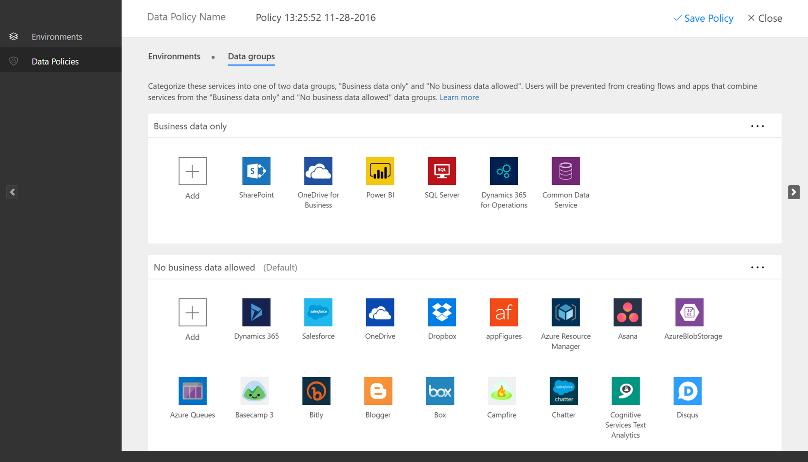

# Fluxo na sua organização Q & A
[!INCLUDE [view-pending-approvals](includes/cc-rebrand.md)]
Este tópico descreve como os usuários em sua organização podem usar o Flow e como você pode controlar o serviço de fluxo.

## Inscrevendo-se no Flow
### O que é Microsoft Flow?
Microsoft Flow é um serviço de nuvem pública para ajudar indivíduos e equipes a configurar fluxos de trabalho automatizados entre seus aplicativos e serviços favoritos para sincronizar, obter notificações, coletar dados e muito mais. 

### Como as pessoas se inscrevem no Flow?
Há duas maneiras possíveis para os indivíduos se inscreverem no Flow por meio do portal da Web:

#### Opção 1
Qualquer pessoa pode se inscrever acessando [Flow.Microsoft.com](https://flow.microsoft.com), selecionando **inscrever-se gratuitamente**e, em seguida, concluindo o processo de inscrição para o flow por meio de [admin.Microsoft.com](https://admin.microsoft.com/Start?sku=flow_free) ou [signup.Live.com](https://signup.live.com).

#### Opção 2
Qualquer pessoa pode se inscrever acessando [Flow.Microsoft.com](https://flow.microsoft.com), selecionando **entrar**, entrando com seu email corporativo, escolar ou pessoal e aceitando os termos de uso do Flow.    

Quando um usuário em sua organização se inscreve no Flow com a opção 2, esse usuário será atribuído a uma licença Microsoft Flow gratuita automaticamente.

[Inscrever-se no Flow](sign-up-sign-in.md) inclui mais detalhes.

### O que é o plano Microsoft Flow gratuito?

O plano gratuito Microsoft Flow é usado apenas para fins de acompanhamento. Habilitar ou desabilitar não tem nenhum efeito sobre a capacidade do usuário de criar fluxos. Se você desabilitar o plano gratuito Microsoft Flow, ele será habilitado novamente quando um usuário fizer logon. Esse é o comportamento esperado.

### Posso bloquear outra pessoa de se inscrever no Flow?
Microsoft Flow é um serviço de nuvem totalmente público, e todos no mundo podem se inscrever e usá-lo para automatizar suas tarefas diárias. Para usar Microsoft Flow não há requisitos que os usuários têm ou usam uma conta do Office 365. Por isso, não há nenhum mecanismo no momento para impedir que outra pessoa use o Flow (já que todos no mundo podem, independentemente de seu endereço de email).

No entanto, se uma pessoa se inscrever para Microsoft Flow e você optar por não oferecer suporte a elas dentro de sua organização, elas não poderão incorrer em custos para sua empresa. Quando um indivíduo se inscreve para Microsoft Flow, a relação é entre essa pessoa e a Microsoft, que é como muitos outros serviços de nuvem da Microsoft, como Bing, Wunderlist, OneDrive ou Outlook.com. O uso de Microsoft Flow de um indivíduo não significa, de forma alguma, que o serviço seja fornecido pela sua organização.

Por fim, se sua empresa quiser restringir o uso de dados somente organizacionais dentro do Microsoft Flow, isso é possível por meio de políticas de DLP (prevenção contra perda de dados).

### Como as pessoas podem obter acesso aos recursos pagos do Microsoft Flow?
Os indivíduos podem obter acesso aos recursos pagos do Microsoft Flow de três maneiras diferentes:

1. Eles podem se inscrever individualmente em uma avaliação do Flow plano 1 ou plano 2 de 90 dias gratuitamente
2. Você pode atribuir uma licença de fluxo a elas no portal de administração do Office 365.
3. Os planos do Office 365 e do Dynamics 365 foram atribuídos ao usuário que inclui acesso ao serviço de fluxo. Consulte a [página de preços do Flow](https://flow.microsoft.com/pricing/) para obter a lista de planos do Office 365 e do Dynamics 365 que incluem recursos de fluxo.

### Posso impedir que outra pessoa use os recursos pagos do Flow?
Qualquer pessoa pode experimentar os recursos pagos de Microsoft Flow por 90 dias e não incorrer em custos. No entanto, você pode gerenciar totalmente a atribuição de licenças pagas perpétuas dentro de sua organização por meio do portal de administração do Office 365.

Assim como nas ofertas gratuitas, se um indivíduo optar por se inscrever para a avaliação que é uma relação direta entre a pessoa e a Microsoft, não necessariamente endossada por sua empresa.

## Administração do Flow
### Por que o ícone de fluxo apareceu no iniciador de aplicativos do Office 365?
Como anunciado em agosto, Microsoft Flow agora é uma parte fundamental do pacote do Office 365. Três meses após este anúncio Microsoft Flow foi habilitado como um serviço como parte de todas as SKUs existentes do Office 365. Como os usuários em todos os lugares do mundo agora podem usar Microsoft Flow, ele apareceu no inicializador de aplicativos para eles.

Consulte a seção a seguir se você quiser remover o bloco de fluxo do inicializador de aplicativo por padrão.

### Como fazer remover Microsoft Flow do inicializador de aplicativos para minha organização?
Se um usuário tiver recebido uma licença plano 1 ou plano 2 do Flow, você poderá executar as seguintes etapas para remover a licença de fluxo para esse usuário, o que removerá o ícone de fluxo do iniciador de aplicativos:

1. Vá para o [portal de administração do Office 365](https://portal.microsoftonline.com/).
2. Na barra de navegação à esquerda, selecione **usuários**e, em seguida, selecione **usuários ativos**.
3. Localize o usuário para o qual você deseja remover a licença e, em seguida, selecione seu nome.
4. No painel detalhes do usuário, na seção **licenças de produto** , selecione **Editar**.
5. Localize a licença chamada **Microsoft Flow plano 1** ou **Microsoft Flow plano 2**, defina a alternância como **desativado** e, em seguida, selecione **salvar**.
   
   

Se um usuário tiver acesso ao Flow por meio de sua licença do plano do Office 365 e do Dynamics 365, você poderá desabilitar o acesso aos recursos adicionais incluídos neste plano executando as seguintes etapas:

1. Vá para o [portal de administração do Office 365](https://portal.microsoftonline.com/).
2. Na barra de navegação à esquerda, selecione **usuários**e, em seguida, selecione **usuários ativos**.
3. Localize o usuário ao qual você deseja remover o acesso e, em seguida, selecione seu nome.
4. No painel detalhes do usuário, na seção **licenças de produto** , selecione **Editar**.
5. Expanda a licença do Office 365 ou Dynamics 365 do usuário, desabilite o acesso ao serviço chamado **Flow para Office 365** ou **flow para Dynamics 365** e, em seguida, selecione **salvar**.
   
   

A remoção em massa de licenças também é possível por meio do PowerShell. Consulte [remover licenças de contas de usuário com o PowerShell do Office 365](https://technet.microsoft.com/library/dn771774.aspx) para obter um exemplo detalhado.   Por fim, outras diretrizes sobre a remoção em massa de serviços dentro de uma licença podem ser encontradas em [desabilitar o acesso aos serviços com o PowerShell do Office 365](https://technet.microsoft.com/library/dn771769.aspx).

A remoção do serviço ou da licença de fluxo de um usuário em sua organização resultará na remoção do ícone de fluxo dos seguintes locais para esse usuário:

1. [Office.com](https://office.com)
   
   
2. Iniciador de aplicativos do Office 365
   
   

Observe que isso removerá apenas o bloco de fluxo por padrão. Um usuário ainda pode optar por usar Microsoft Flow como um indivíduo.

### Por que as 10.000 licenças do Microsoft Flow aparecem no meu locatário do Office 365?
Qualquer pessoa pode experimentar Microsoft Flow plano 1 ou 2 por 90 dias, e essas licenças de avaliação representam a capacidade disponível para novos usuários de fluxo em seu locatário. Não há nenhum encargo para essas licenças. Especificamente, há dois motivos possíveis pelos quais você pode ver uma capacidade 10.000 (avaliação) de licenças para o fluxo exibido no portal de administração do Office 365:

1. Se pelo menos um usuário em seu locatário tiver participado da visualização pública do Flow que se abarcau de abril de 2016 a 2016 de outubro, você verá licenças 10.000 rotuladas como "Microsoft PowerApps e fluxos lógicos"
   
    
2. Se pelo menos um usuário em seu locatário tiver se inscrito em uma avaliação do plano 2 do Flow por meio da opção de inscrição de avaliação **1** descrita na seção [como os usuários se inscrevem no PowerApps](#how-do-people-sign-up-for-flow) , você verá as licenças 10.000 rotuladas como "Microsoft Power Apps & Flow"
   
    

Você pode optar por atribuir licenças adicionais a usuários por conta própria no portal de administração do Office 365, mas observe que essas são licenças de avaliação para Microsoft Flow plano 2 e elas expirarão após 90 dias de atribuição a um usuário.

### Isso é gratuito? Serei cobrado por essas licenças?
Nenhum usuário pode incorrer em nenhum custo para sua organização sem o seu consentimento expresso, portanto, nenhuma licença gratuita ou de avaliação pode causar cobranças à sua organização. Além disso, eles também não usam nenhuma cota, como as cotas de execução.

### Eu removi o Microsoft Flow licença gratuita e os usuários ainda podem acessar o Flow?
A licença gratuita Microsoft Flow está incluída apenas para fins de acompanhamento. Conforme abordado na primeira seção, não é possível impedir que outra pessoa use Microsoft Flow para fins individuais. Assim, a presença de uma licença Microsoft Flow gratuita não concede nem remove nenhum recurso.

### Por que não consigo ver todas as licenças de fluxo no portal de administração do Office 365?
Os usuários podem usar o Microsoft Flow como indivíduos ou como parte de sua organização. As licenças no nível da organização sempre estarão visíveis no portal do Office 365. No entanto, se um usuário se inscrever para uma avaliação como um indivíduo, isso não será gerenciado pelo administrador do Office 365 e não aparecerá no Portal.

### Como um indivíduo descobre em qual plano eles estão?
Qualquer pessoa pode ver o plano que eles têm visitando a página de preços do Flow em [https://flow.microsoft.com/pricing](https://flow.microsoft.com/pricing). O plano ou a avaliação em que eles estão no momento serão mostrados lá.

### A inscrição Microsoft Flowá o impacto das identidades em minha organização?
Se sua organização já tiver um ambiente existente do Office 365 e todos os usuários em sua organização tiverem contas do Office 365, o gerenciamento de identidades não será afetado.

Se sua organização já tiver um ambiente existente do Office 365, mas nem todos os usuários em sua organização tiverem contas do Office 365, criaremos um usuário no locatário e atribuíremos licenças com base no endereço de email corporativo ou de estudante do usuário. Isso significa que o número de usuários que você está gerenciando a qualquer momento específico aumentará à medida que os usuários em sua organização se inscreverem no serviço.

Se sua organização não tiver um ambiente do Office 365 conectado ao seu domínio de email, não haverá alteração na maneira como você gerencia a identidade. Os usuários serão adicionados a um novo diretório de usuário somente na nuvem, e você terá a opção de assumir o administrador do locatário e gerenciá-los.

### Um novo locatário foi criado por Microsoft Flow, como posso gerenciá-lo?
Se um novo locatário foi criado por Microsoft Flow, você poderá reivindicar e gerenciar esse locatário usando as seguintes etapas:

1. Ingresse o locatário inscrevendo-se no Flow usando um domínio de endereço de email que corresponda ao domínio de locatário que você deseja gerenciar. Por exemplo, se a Microsoft criou o locatário contoso.com, ingresse no locatário com um endereço de email que termina com @contoso.com.
2. Solicite o controle de administração verificando a propriedade do domínio: quando estiver no locatário, você poderá se promover para a função de administrador verificando a propriedade do domínio. Para fazer isso, siga estas etapas:    
   
   1. Vá para [https://admin.microsoft.com](https://admin.microsoft.com/Start?sku=flow_free).
   2. Selecione o ícone do inicializador de aplicativo no canto superior esquerdo e escolha admin.
   3. Leia as instruções na página **tornar-se o administrador** e, em seguida, escolha **Sim, quero ser o administrador**.  
      
       **Observação**: se essa opção não aparecer, um administrador do Office 365 já estará em vigor.

### Se eu tiver vários domínios, posso controlar o locatário do Office 365 ao qual os usuários são adicionados?
Se você não fizer nada, um locatário será criado para cada domínio de email e subdomínio do usuário.

Se você quiser que todos os usuários estejam no mesmo locatário, independentemente de suas extensões de endereço de email:  

* Crie um locatário de destino antecipadamente ou use um locatário existente. Adicione todos os domínios e subdomínios existentes que você deseja consolidar dentro desse locatário. Em seguida, todos os usuários com endereços de email que terminam nesses domínios e subdomínios ingressam automaticamente no locatário de destino quando eles se inscrevem.

**Importante**: não há nenhum mecanismo automatizado com suporte para mover os usuários entre locatários depois que eles tiverem sido criados. Para saber mais sobre como adicionar domínios a um único locatário do Office 365, consulte [adicionar seus usuários e domínio ao Office 365](https://support.office.com/article/Add-your-users-and-domain-to-Office-365-ffdb2216-330d-4d73-832b-3e31bcb5b2a7).

### Como posso restringir a capacidade dos meus usuários de acessar os dados corporativos da minha organização?
Microsoft Flow permite que você crie zonas de dados para dados corporativos e não comerciais, conforme mostrado abaixo. Depois que essas políticas de prevenção de perda de dados são implementadas, os usuários são impedidos de criar ou executar o fluxo que combina dados comerciais e não comerciais. Para obter mais detalhes, consulte [políticas de prevenção de perda de dados (DLP)](prevent-data-loss.md).

  

