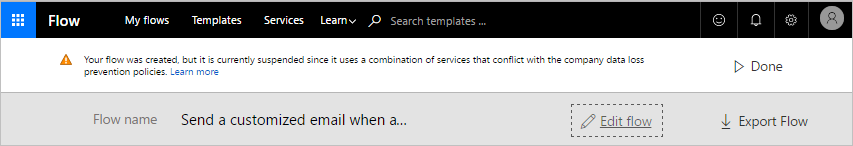

# Políticas de prevenção contra perda de dados (DLP)
[!INCLUDE [view-pending-approvals](includes/cc-rebrand.md)]

Este documento apresenta as políticas de prevenção de perda de dados, que ajudam a proteger seus dados organizacionais de serem compartilhados com uma lista de conectores que você define.

## O que é uma política de prevenção de perda de dados?

Os dados de uma organização são fundamentais para o seu sucesso. Seus dados precisam estar prontamente disponíveis para tomada de decisões, mas precisam ser protegidos para que não sejam compartilhados com públicos que não deveriam ter acesso a ele. Para proteger esses dados, Microsoft Flow fornece a capacidade de criar e impor políticas que definem quais conectores de consumidor podem acessar e compartilhar dados corporativos. Essas políticas que definem como os dados podem ser compartilhados são chamadas de políticas de prevenção de perda de dados (DLP).

## Por que criar uma política de DLP?

Você cria a política de DLP para definir claramente quais conectores de consumidor podem acessar e compartilhar seus dados corporativos. Por exemplo, uma organização que usa Microsoft Flow pode não querer que seus dados corporativos no SharePoint sejam publicados automaticamente em seu feed do Twitter. Para evitar isso, você cria uma política de DLP que impede que os dados do SharePoint sejam usados como a origem para tweets.

## Benefícios de uma política de DLP

* Garante que os dados sejam gerenciados de maneira uniforme em toda a organização.
* Impede que dados corporativos importantes sejam publicados acidentalmente em conectores como sites de mídia social.

## Gerenciando políticas DLP

### Pré-requisitos para gerenciar políticas DLP

* Permissões de administrador de ambiente ou de administrador de locatário.

    Você pode saber mais sobre as permissões no [artigo sobre ambientes](environments-overview-admin.md).
* Uma [licença Microsoft Flow P2](billing-questions.md).

## Criar uma política de DLP

### Pré-requisitos para a criação de políticas DLP

Para criar uma política de DLP, você deve ter permissões para pelo menos um ambiente.

Siga estas etapas para criar uma política de DLP que impede que os dados no site do SharePoint da sua empresa sejam publicados no Twitter:

1. Entre no [centro de administração do Microsoft Flow](https://admin.flow.microsoft.com) (centro de administração).

1. Selecione a guia políticas de dados e, em seguida, selecione o link **nova política** :

    
1. Selecione a guia **grupos de dados** .

1. Insira o nome da política de DLP como *acesso a dados seguros para contoso* no rótulo **nome da política de dados** na parte superior da página:

    

1. Selecione o [ambiente](environments-overview-admin.md) na guia **ambientes** .

    > [!NOTE]
    > Como administrador de ambiente, você pode criar políticas que se aplicam a um único ambiente. Como administrador de locatários, você pode criar políticas que se aplicam a qualquer combinação de ambientes:
    >
    >

    

1. Selecione a guia **grupos de dados** :

    

1. Selecione o link **Adicionar** localizado dentro da caixa de grupo **somente dados de negócios** :

    

1. Selecione os conectores do **SharePoint** e do **Salesforce** na página **Adicionar conectores** :

   

1. Selecione o botão **Adicionar conectores** para adicionar os conectores que podem compartilhar dados corporativos.

1. Selecione **salvar política** no canto superior direito da tela.

1. Após alguns instantes, sua nova política de DLP será exibida na lista políticas de prevenção de perda de dados:

    

1. **Opcional** Envie um email ou outra comunicação para sua equipe, alertando-o de que uma nova política de DLP já está disponível.

Parabéns, você criou uma política de DLP que permite que o aplicativo Compartilhe dados entre o SharePoint e o Salesforce e bloqueia o compartilhamento de dados com outros serviços.

> [!NOTE]
> A adição de um serviço a um grupo de dados o remove automaticamente do outro grupo de dados. Por exemplo, se o Twitter estiver atualmente localizado no grupo de dados **somente dados de negócios** e você não quiser permitir que os dados corporativos sejam compartilhados com o Twitter, basta adicionar o serviço do Twitter ao grupo de dados dados de **negócios não permitidos** . Isso removerá o Twitter do grupo de dados somente dados de negócios.
>
>

## Violações de compartilhamento de dados

Supondo que você criou a política de DLP descrita acima, se um usuário criar um fluxo que compartilha dados entre o Salesforce (que está no grupo de dados **somente dados de negócios** ) e o Twitter (que está no grupo de dados de dados de **negócios não permitidos** ), o usuário será informado de que o fluxo foi **suspenso** devido a um conflito com a política de prevenção de perda de dados que você criou.

Se os usuários entrarem em contato com você sobre fluxos suspensos, aqui estão algumas coisas a considerar:

1. Neste exemplo, se houver um motivo comercial válido para compartilhar dados corporativos entre o SharePoint e o Twitter, você poderá editar a política de DLP.

1. Peça ao usuário para editar o fluxo para estar em conformidade com a política de DLP.

1. Peça ao usuário para deixar o fluxo no estado suspenso até que seja tomada uma decisão em relação ao compartilhamento de dados entre essas duas entidades.

## Localizar uma política de DLP

### Administradores

Os administradores podem usar o recurso de pesquisa do centro de administração para localizar políticas de DLP específicas.

> [!NOTE]
> Os administradores devem publicar todas as políticas de DLP para que os usuários na organização estejam cientes das políticas antes da criação de fluxos.
>
>

### Tomadores

Se você não tiver permissões de administrador e quiser saber mais sobre as políticas de DLP em sua organização, entre em contato com o administrador. Você também pode aprender mais no [artigo sobre ambientes do criador](environments-overview-maker.md)

> [!NOTE]
> Somente administradores podem editar ou excluir políticas de DLP.
>
>

## Editar uma política de DLP

1. Inicie o [centro de administração](https://admin.flow.microsoft.com).

1. No centro de administração que é iniciado, selecione o link **políticas de dados** no lado esquerdo.

    

1. Pesquise a lista de políticas de DLP existentes e selecione o botão Editar ao lado da política que você pretende editar.

1. Faça as alterações necessárias na política. Você pode modificar o ambiente ou os serviços nos grupos de dados, por exemplo.

1. Selecione **salvar política** para salvar as alterações.

> [!NOTE]
> As políticas de DLP criadas por administradores de locatário podem ser exibidas por administradores de ambiente, mas não podem ser editadas por administradores de ambiente.
>
>

## Excluir uma política de DLP

1. Inicie o [centro de administração](https://admin.flow.microsoft.com).

1. Selecione a guia **políticas de dados** no lado esquerdo.

    

1. Pesquise a lista de políticas de DLP existentes e, em seguida, selecione o botão excluir ao lado da política que você pretende excluir:

    

1. Confirme que você realmente deseja excluir a política selecionando o botão **excluir** :

    

## Permissões de política de DLP

Somente administradores de locatários e de ambiente podem criar e modificar políticas de DLP. Saiba mais sobre as permissões no artigo sobre [ambientes](environments-overview-admin.md) .

## Conectores personalizados e HTTP

Os conectores personalizado e HTTP devem ser adicionados ao DLPs usando um modelo de Microsoft Flow ou um PowerShell.

> [!TIP]
> Não é possível fazer downgrade do esquema da versão 2018-11-01. O suporte a HTTP não pode ser removido de uma política. Se você tentar remover o suporte a HTTP, a política de DLP poderá estar corrompida. Além disso, se uma política de DLP for atualizada para dar suporte a conectores HTTP, os fluxos atuais usando esses recursos de HTTP poderão ser desligados.

Aqui estão os conectores HTTP que você pode adicionar a uma política:

- HTTP (e HTTP + Swagger)
- Webhook HTTP
- Solicitação HTTP

## Adicionar conectores personalizados e de conectores HTTP com modelos

Para adicionar um conector personalizado a uma política usando um [modelo](https://flow.microsoft.com/galleries/public/templates/ae9683086770420e902c043e5ed4b363/), insira o nome da política, o grupo ao qual adicionar o conector e o nome, a ID e o tipo do conector. Execute o fluxo uma vez para adicionar o conector personalizado à política e ao grupo fornecido.

Para adicionar os conectores HTTP a uma política existente por meio do [modelo](https://flow.microsoft.com/galleries/public/templates/834eb1366aa54335a5f979014a9e0477/), insira o nome da política à qual você deseja adicioná-los e execute o fluxo.

## Adicionar conectores personalizados e HTTP com o PowerShell

Para adicionar suporte a conectores personalizados e/ou conectores HTTP a uma política usando o PowerShell, [Baixe](https://docs.microsoft.com/powerapps/administrator/powerapps-powershell) e importe os scripts mais recentes do PowerShell do PowerApps e, em seguida, use estes cmdlets: "New-AdminDlpPolicy", "Set-AdminDlpPolicy", " Add-CustomConnectorToPolicy ' e ' remove-CustomConnectorFromPolicy ' para modificar a política. Use o cmdlet ' Get-Help-detailed ' como uma referência.

> [!IMPORTANT]
> Use a versão de esquema 2018-11-01 ao criar ou atualizar uma política de DLP para incluir conectores HTTP. Adicionar suporte a HTTP usando o modelo ou o PowerShell afetará apenas a política especificada. As novas políticas criadas por meio do centro de administração não conterão os conectores HTTP.

## Próximas etapas

* [Saiba mais sobre ambientes](environments-overview-admin.md)
* [Saiba mais sobre o Microsoft Flow](getting-started.md)
* [Saiba mais sobre o centro de administração](admin-center-introduction.md)
* [Saiba mais sobre a integração de dados](https://docs.microsoft.com/common-data-service/entity-reference/dynamics-365-integration)
