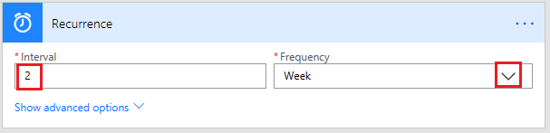

# Executar fluxos em uma agenda
[!INCLUDE [view-pending-approvals](includes/cc-rebrand.md)]
Crie um fluxo que executa uma ou mais tarefas (como enviar um relatório no email):

* uma vez por dia, uma hora ou um minuto
* em uma data que você especificar
* após um número de dias, horas ou minutos que você especificar

## Criar um fluxo recorrente
1. Entre no [Microsoft Flow](https://flow.microsoft.com)e, em seguida, selecione **meus fluxos** na barra de navegação superior.
   
    
2. Selecione **criar em branco**.
   
    
3. Na caixa **Pesquisar todos os conectores e gatilhos** , digite **recorrência**e selecione **agenda-recorrência**.
   
    
4. Na caixa de diálogo **recorrência** , especifique com que frequência você deseja que o fluxo seja executado.
   
    Por exemplo, especifique **2** em **intervalo** e **semana** em **frequência** se você quiser que o fluxo seja executado a cada duas semanas.
   
    

## Especificar opções avançadas
1. Siga as etapas na seção anterior e, em seguida, selecione **Mostrar opções avançadas**.
   
    **Observação**: essas opções são alteradas com base nos valores para os quais o **intervalo** e a **frequência** são definidos. Se a tela não corresponder ao gráfico abaixo, verifique se o **intervalo** e a **frequência** estão definidos com os mesmos valores mostrados pelo gráfico.
2. Selecione um **fuso horário** para especificar se a **hora de início** reflete um fuso horário local, UTC (horário coordenado universal) etc.
3. Especifique uma **hora de início** neste formato:
    AAAA-MM-DDTHH: MM: SSZ
4. Se você especificou **dia** em **frequência**, especifique a hora do dia em que o fluxo deve ser executado.
5. Se você especificou **semana** em **frequência**, especifique o dia ou os dias da semana em que o fluxo deve ser executado e a hora ou as horas do dia em que o fluxo deve ser executado.
   
    Por exemplo, configure as opções conforme mostrado para iniciar um fluxo não antes do meio-dia (hora do Pacífico) na segunda-feira, 1º de janeiro de 2018 e execute-o a cada duas semanas às terças-feiras às 30P (hora do Pacífico).
   
    
6. Adicione a ação ou ações que você deseja que o fluxo execute, como descrito [em criar um fluxo do zero](get-started-logic-flow.md) .

## Atrasar um fluxo
1. Entre no [Microsoft Flow](https://flow.microsoft.com)e, em seguida, selecione **meus fluxos** na barra de navegação superior.
   
    
2. Selecione **criar em branco**.
   
    
3. Especifique um evento como [criar um fluxo do zero](get-started-logic-flow.md) descreve.
4. Selecione **nova etapa**e, em seguida, selecione **Adicionar uma ação**.
   
    
5. Na lista de ações, siga um destes procedimentos:
   
   * Selecione **atraso**, especifique uma **contagem**e especifique uma **unidade** de tempo, como segundo, minuto ou hora.
   * Selecione **atrasar até**e, em seguida, especifique uma data neste formato. AAAA-MM-DDTHH: MM: SSZ
     
     
     
     

## Saiba Mais

Saiba mais sobre as [Opções avançadas](https://docs.microsoft.com/azure/connectors/connectors-native-recurrence) e como configurá-las.

