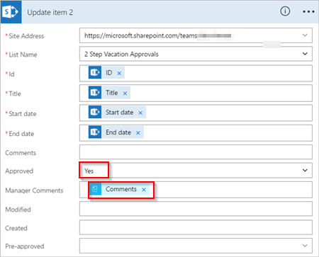

# Gerenciar aprovações sequenciais com o Microsoft Flow
[!INCLUDE [view-pending-approvals](includes/cc-rebrand.md)]
Alguns fluxos de trabalho exigem aprovação prévia antes que o aprovador final seja solicitado a fazer logoff. Por exemplo, uma empresa pode ter uma política de aprovação sequencial que requer aprovação prévia para faturas acima de $1000 antes que elas sejam aprovadas pelo departamento financeiro.

Neste tutorial, criamos um fluxo de aprovação sequencial que gerencia solicitações de férias do funcionário.

> [!NOTE]
> O SharePoint é usado aqui apenas como exemplo; Não é necessário criar fluxos de aprovação. Você pode usar qualquer um dos mais de 200 serviços com os quais o Microsoft Flow se integra para impulsionar seus fluxos.

## Etapas detalhadas no fluxo
O fluxo:

1. Inicia quando um funcionário cria uma solicitação de férias em uma [lista do SharePoint Online](https://support.office.com/article/Introduction-to-lists-0a1c3ace-def0-44af-b225-cfa8d92c52d7).
2. Adiciona a solicitação de férias ao centro de aprovação e, em seguida, envia a solicitação por email para o aprovador prévio.
3. Envia por email a decisão de pré-aprovação para o funcionário.
4. Atualiza a lista do SharePoint Online com a decisão e os comentários do aprovador.
   
   Observação: se a solicitação for previamente aprovada, o fluxo continuará com estas etapas:
5. Envia a solicitação para o aprovador final.
6. Envia por email a decisão final para o funcionário.
7. Atualiza a lista do SharePoint com a decisão final.

Esta imagem resume as etapas anteriores:

   

## Pré-requisitos
[!INCLUDE [prerequisites-for-modern-approvals](includes/prerequisites-for-modern-approvals.md)]

Para os fins deste passo a passos, a lista do SharePoint Online que você cria deve incluir as seguintes colunas:

   

Anote o nome e a URL da lista do SharePoint Online. Usaremos esses itens posteriormente ao configurar o gatilho **SharePoint-quando um novo item é criado** .

## Criar seu fluxo a partir do modelo em branco
[!INCLUDE [sign-in-and-create-flow-from-blank-template](includes/sign-in-and-create-flow-from-blank-template.md)]

## Adicionar um gatilho
[!INCLUDE [add-trigger-when-sharepoint-item-created](includes/add-trigger-when-sharepoint-item-created.md)]

   

## Obter o gerente da pessoa que criou a solicitação de férias
[!INCLUDE [add-get-manager-action](includes/add-get-manager-action.md)]

1. Forneça um nome para o fluxo e, em seguida, selecione **criar fluxo** para salvar o trabalho que fizemos até agora.
   
    
   
   > [!NOTE]
   > Selecione **Atualizar fluxo** na parte superior da tela periodicamente para salvar as alterações no fluxo.
   > 
   > 
   
    

Após cada operação de salvamento, selecione **Editar fluxo** na parte superior da tela e continue fazendo alterações.

## Adicionar uma ação de aprovação para aprovações prévias
[!INCLUDE [add-an-approval-action](includes/add-an-approval-action.md)]

Observação: essa ação envia a solicitação de aprovação prévia para o endereço de email na caixa **atribuído a** .

## Adicionar uma condição
[!INCLUDE [add-approval-condition-response](includes/add-approval-condition-response.md)]

> [!NOTE]
> Essa condição verifica a resposta da ação **iniciar uma aprovação** .
> 
> 

## Adicionar uma ação de email para aprovações prévias
[!INCLUDE [add-action-to-send-email-when-vacation-approved](includes/add-action-to-send-email-when-vacation-approved.md)]

   

## Adicionar uma ação de atualização para solicitações previamente aprovadas
[!INCLUDE [add-action-to-update-sharepoint-with-approval](includes/add-action-to-update-sharepoint-with-approval.md)]

   

## Obter o Gerenciador do aprovador prévio
1. Use as etapas [obter o gerente para a pessoa que criou a solicitação de férias](sequential-modern-approvals.md#get-the-manager-for-the-person-who-created-the-vacation-request) que fizemos anteriormente para adicionar e, em seguida, configure outra ação **obter gerenciador** . Desta vez, obtemos o Gerenciador do aprovador prévio.
2. O cartão **Get Manager 2** deve ser semelhante a esta imagem quando você terminar. Certifique-se de usar o token de **email** da categoria **obter gerente** no cartão **adicionar conteúdo dinâmico do aplicativos e serviços usados neste fluxo** .
   
   

## Adicionar a ação de aprovação final
1. Use a ação [Adicionar uma aprovação para etapas anteriores](sequential-modern-approvals.md#add-an-approval-action-for-pre-approvals) à aprovação que fizemos anteriormente para adicionar e, em seguida, configure outra ação **iniciar uma aprovação** . Essa ação envia uma solicitação de email para aprovação final.
2. Quando você terminar, o cartão deverá ser semelhante a esta imagem:
   
    

## Adicionar a condição de aprovação final
1. Repita as etapas em [Adicionar uma condição](sequential-modern-approvals.md#add-a-condition) a ser adicionada e, em seguida, configure uma **condição** que verifica a decisão do aprovador final.

## Enviar email com aprovação final
1. Use as etapas de [Adicionar uma ação de email para aprovações prévias](sequential-modern-approvals.md#add-an-email-action-for-pre-approvals) a serem adicionadas e, em seguida, configure uma ação que envia um email quando as solicitações de férias são aprovadas.
2. Quando tiver terminado, seu cartão deverá ser semelhante a esta imagem:
   
   

## Atualizar o SharePoint com aprovação
1. Use as etapas de [Adicionar uma ação de atualização para solicitações previamente aprovadas](sequential-modern-approvals.md#add-an-update-action-for-pre-approved-requests) para adicionar e, em seguida, configurar uma ação que atualiza o SharePoint quando a solicitação de férias é aprovada.
2. Quando tiver terminado, o cartão deverá ser semelhante a esta imagem:
   
    

## Enviar email com rejeição de pré-aprovação
[!INCLUDE [add-action-to-send-email-when-vacation-rejected](includes/add-action-to-send-email-when-vacation-rejected.md)]

   

Observação: essa ação deve ser adicionada à ramificação **se não, não fazer nada** abaixo do cartão de **condição** .

## Atualizar o SharePoint com a rejeição de pré-aprovação
[!INCLUDE [add-action-to-update-sharepoint-with-rejection](includes/add-action-to-update-sharepoint-with-rejection.md)]

   

## Enviar email com rejeição final
1. Use as etapas de [Enviar email com rejeição de pré-aprovação](sequential-modern-approvals.md#send-email-with-pre-approval-rejection) para adicionar e, em seguida, configurar uma ação que envia um email quando a solicitação de férias é rejeitada pelo aprovador final.
   
    Observação: essa ação deve ser adicionada à ramificação **se não, não fazer nada** abaixo do cartão da **condição 2** .
2. Quando tiver terminado, o cartão deverá ser semelhante a esta imagem:
   
   

## Atualizar o SharePoint com rejeição final
1. Use as etapas de [atualizar o SharePoint com rejeição de pré-aprovação](sequential-modern-approvals.md#update-sharepoint-with-pre-approval-rejection) para adicionar e, em seguida, configurar uma ação que atualiza o SharePoint se o aprovador final rejeitar a solicitação de férias.
2. Quando tiver terminado, o cartão deverá ser semelhante a esta imagem:
   
   
3. Selecione **Atualizar fluxo** para salvar o trabalho que fizemos.
   
   

Se você seguiu, seu fluxo deve ser semelhante a esta imagem:

Agora que criamos o fluxo, vamos vê-lo em ação.

## Solicitar uma aprovação
[!INCLUDE [request-vacation-approval](includes/request-vacation-approval.md)]

Sua solicitação deve ser semelhante a esta imagem:

## Exibir solicitações de aprovação pendentes
[!INCLUDE [view-pending-approvals](includes/view-pending-approvals.md)]

## Aprovar previamente uma solicitação
[!INCLUDE [approve-request-from-different-locations](includes/approve-request-from-different-locations.md)]

## Aprovar a solicitação
As etapas para aprovar uma solicitação são idênticas às etapas para [aprovar previamente uma solicitação](sequential-modern-approvals.md#pre-approve-a-request)

Observação: o aprovador final Obtém a solicitação de férias somente depois que a solicitação foi aprovada previamente.

## Rejeitar uma solicitação
[!INCLUDE [reject-a-request](includes/reject-a-request.md)]

## Mais informações
[Passo a passos de aprovações modernas de aprovador único](modern-approvals.md)

