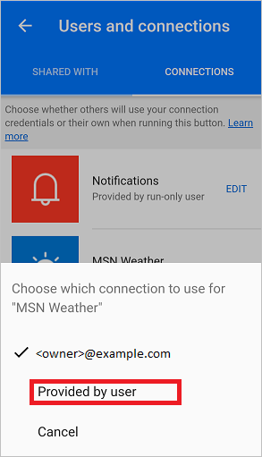
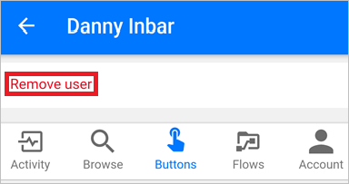

# Compartilhar fluxos de botão em Microsoft Flow
[!INCLUDE [view-pending-approvals](includes/cc-rebrand.md)]
No aplicativo móvel Microsoft Flow, você pode compartilhar [fluxos de botão](introduction-to-button-flows.md) (botões) com outros usuários ou grupos dentro de sua organização. Quando você compartilha um botão, a pessoa ou grupo com quem você compartilha pode executar seu botão, da mesma forma que executam seus próprios botões. Você também pode [compartilhar um link](share-buttons.md#re-share-a-button) para botões que outra pessoa compartilhou com você. Você pode [interromper o compartilhamento](share-buttons.md#stop-sharing-a-button) de seus botões a qualquer momento.

> As capturas de tela usadas neste documento foram tiradas de um dispositivo Android. Se você estiver usando um iPhone, as imagens poderão aparecer de forma diferente, mas a funcionalidade será a mesma.
> 
> 

Siga [estas etapas](share-buttons.md#use-shared-buttons) para usar um botão que alguém compartilhou com você.

## Pré-requisitos
Para compartilhar botões, você precisa de:

* Uma conta com acesso a [Microsoft Flow](https://flow.microsoft.com).
* Um fluxo para compartilhar.
* Um dispositivo móvel com o aplicativo móvel Microsoft Flow para [Android](https://aka.ms/flowmobiledocsandroid), [Ios](https://aka.ms/flowmobiledocsios)ou [Windows Phone](https://aka.ms/flowmobilewindows).
* Um grupo ou usuário em sua organização com o qual compartilhar seu botão.

## Compartilhar um botão
Você pode compartilhar um botão da guia **botões** do aplicativo móvel Microsoft Flow.

1. Toque no ícone pequeno ao lado do botão que você deseja compartilhar.
   
    
2. Toque em **convidar outras pessoas** na página **usuários do botão** .
   
    
3. Procure e selecione o grupo ou pessoa com quem você gostaria de compartilhar o botão.
   
    
4. Toque em **Enviar** na página **convidar outras pessoas** .
   
    
5. Toque em **concluído** na página que indica que a operação de compartilhamento de botão foi concluída com êxito.
   
    

## Exigir que os usuários usem suas próprias conexões
> [!NOTE]
> Ao compartilhar um botão, você pode permitir que pessoas com quem você compartilhou o botão usem todas as conexões que seu botão usa. Você também pode exigir que eles usem suas próprias conexões. Se você permitir que outras pessoas usem suas conexões, elas não poderão acessar as credenciais em sua conexão ou reutilizá-las em qualquer outro fluxo.
> 
> 

Siga estas etapas para exigir que pessoas com quem você compartilhou seus botões usem suas próprias conexões.

1. Selecione **gerenciar conexões** na tela exibida imediatamente depois de compartilhar um botão.
2. Selecione **Editar** no botão que você deseja gerenciar.
3. Selecione **fornecido pelo usuário** ou seu endereço de email.
   
    Sua escolha indica cujas conexões devem ser usadas no botão compartilhado.
   
    
   
    Você pode exibir ou alterar sua escolha a qualquer momento. Para fazer isso, selecione a guia **fluxos** > o fluxo que você compartilhou > **usuários e conexões** > guia **conexões** > **Editar** no botão que você deseja gerenciar.
   
    

## Exibir a lista de usuários de botão
Você pode exibir todos os grupos ou usuários com os quais um botão é compartilhado seguindo estas etapas na guia **botões** :

1. Toque no ícone pequeno ao lado do botão no qual você está interessado.
2. Na página **usuários do botão** , exiba todos os grupos ou usuários com os quais o botão é compartilhado.
   
    

## Interromper o compartilhamento de um botão
Você pode interromper o compartilhamento de um botão seguindo estas etapas na guia **botões** :

1. Toque no ícone pequeno ao lado do botão que você não deseja mais compartilhar.
2. Na página **usuários do botão** , toque no usuário ou grupo com o qual você deseja interromper o compartilhamento do botão.
   
    
3. Toque em **remover usuário** quando a página do usuário for exibida.
   
    
4. Aguarde a conclusão da operação de remoção. Observe que a lista **usuários de botão** é atualizada e o usuário ou grupo que você removeu não está mais listado.
   
    

## Monitorar o histórico de execuções
Todo o histórico de execução, incluindo as execuções iniciadas por uma pessoa com a qual um botão é compartilhado, aparece apenas na guia **atividade** do aplicativo móvel Microsoft Flow do criador do botão.

## Usar botões compartilhados
Antes de executar um botão que alguém compartilhou com você, você deve adicioná-lo à sua guia **botões** na página **adicionar botões** .

1. Toque em **obter mais** (ou os **novos botões estarão disponíveis** na faixa, se aparecer) na guia **botões** .
   
    
2. Toque no botão que você deseja usar.
   
    O botão tocado é adicionado imediatamente à guia **botões** do aplicativo Microsoft Flow. Você pode usar o botão da guia **botões** , assim como qualquer outro botão listado ali.
   
    

## Compartilhar novamente um botão
Você pode compartilhar um link para um botão que foi compartilhado com você.

1. Selecione **...** ao lado do botão que você deseja compartilhar.
2. Selecione o **link do botão compartilhar**.
   
    
3. Selecione o aplicativo que você gostaria de usar para compartilhar o botão e, em seguida, siga as etapas para enviar o botão para a pessoa com a qual você deseja compartilhar.

## Parar de usar um botão compartilhado
Se você não quiser mais usar um botão que foi compartilhado com você, remova-o da guia **botões** executando estas etapas:

1. Na guia **botões** , toque em **...** ao lado do botão que você não deseja mais usar.
   
    
2. Toque em **remover** no menu exibido.

É isso. O botão não aparece mais na guia **botões** do aplicativo Microsoft Flow.

> [!NOTE]
> Depois de remover um botão compartilhado, você pode adicioná-lo de volta selecionando **obter mais** na guia **botões** .
> 
> 

