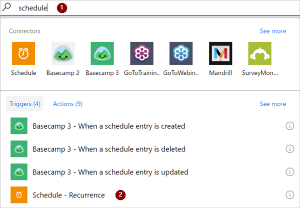
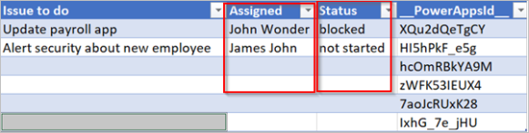

# <a name="use-expressions-in-conditions-to-check-multiple-values"></a>Usar expressões em condições para verificar vários valores
[!INCLUDE [view-pending-approvals](includes/cc-rebrand.md)]
Neste tutorial, você aprenderá a usar expressões e **condições** para comparar vários valores no **modo avançado**.

Ao criar um fluxo, você pode usar o cartão [**condição**](add-condition.md#add-a-condition) no modo básico para comparar rapidamente um único valor com outro valor. No entanto, há ocasiões em que você precisa comparar vários valores. Por exemplo, talvez você queira verificar o valor de algumas colunas em uma planilha ou tabela de banco de dados.

Você pode usar qualquer combinação das seguintes expressões lógicas em suas condições.

expressão|Ndescrição|Exemplo
--------|-----------|-------
|[e](#use-the-and-expression)|Usa dois argumentos e retorna true se ambos os valores forem verdadeiros.<br><b>Observação</b>: ambos os argumentos devem ser boolianos.|Essa expressão retorna false: <br>e (maior (1, 10), Equals (0, 0))
|[or](#use-the-or-expression)|Usa dois argumentos e retorna true se um dos argumentos for true. <br><b>Observação</b>: ambos os argumentos devem ser boolianos.|Essa expressão retorna true:<br>ou (maior (1, 10), Equals (0, 0))
|Seja|Retornará true se dois valores forem iguais.|Por exemplo, se parâmetro1 for someValue, essa expressão retornará true:<br>Equals (Parameters (' parâmetro1 '), ' someValue ')
|[inferiores](#use-the-less-expression)|Usa dois argumentos e retorna true se o primeiro argumento for menor que o segundo argumento. <br><b>Observação</b>: os tipos com suporte são inteiro, flutuante e cadeia de caracteres.|Essa expressão retorna true:<br>Less (10100)
|lessOrEquals|Usa dois argumentos e retorna true se o primeiro argumento for menor ou igual ao segundo argumento. <br><b>Observação</b>: os tipos com suporte são inteiro, flutuante e cadeia de caracteres.|Essa expressão retorna true:<br>lessOrEquals (10, 10)
|[grande](#use-the-greater-expression)|Usa dois argumentos e retorna true se o primeiro argumento for maior que o segundo argumento. <br><b>Observação</b>: os tipos com suporte são inteiro, flutuante e cadeia de caracteres.|Essa expressão retorna false:<br>maior (10, 10)
|greaterOrEquals|Usa dois argumentos e retorna true se o primeiro argumento for maior ou igual ao segundo argumento. <br><b>Observação</b>: os tipos com suporte são inteiro, flutuante e cadeia de caracteres.|Essa expressão retorna false:<br>greaterOrEquals (10100)
|[esvaziá](#use-the-empty-expression)|Retornará true se o objeto, matriz ou cadeia de caracteres estiver vazio.|Essa expressão retorna true:<br>vazio (' ')
|válido|Retorna o oposto de um valor booliano. |Essa expressão retorna true:<br>not (contém (' 200 êxito ', ' falha '))
|que|Retorna um valor específico se a expressão resulta em true ou false.|Essa expressão retorna "Sim":<br>If (Equals (1, 1), ' Yes ', ' no ')

## <a name="prerequisites"></a>Pré-requisitos
* Acesso a Microsoft Flow.
* Uma planilha com as tabelas descritas mais adiante neste guia. Lembre-se de salvar sua planilha em um local como o Dropbox ou o Microsoft OneDrive para que Microsoft Flow possa acessá-la.
* Microsoft Office o Outlook 365 (enquanto usamos o Office 365 Outlook, você pode usar qualquer serviço de email com suporte em seus fluxos.)

## <a name="use-the-or-expression"></a>Usar a expressão ou
Às vezes, o fluxo de trabalho precisa tomar uma ação se o valor de um item for Valora **ou** valorB. Por exemplo, você pode estar acompanhando o status das tarefas em uma tabela de planilha. Suponha que a tabela tenha uma coluna chamada *status* e os valores possíveis na coluna *status* sejam:

* **conclusão**
* **obstruído**
* **necessidade**
* **não iniciado**

Aqui está um exemplo de como a planilha poderia ser:


Dada a planilha anterior, você deseja usar Microsoft Flow para remover todas as linhas com uma coluna de *status* definida como *concluída* ou *desnecessária*.

Vamos criar o fluxo.

### <a name="start-with-a-blank-flow"></a>Iniciar com um fluxo em branco
1. Entre [Microsoft Flow](https://flow.microsoft.com).

    
2. Selecione a guia **meus fluxos** .

    
3. Selecione **criar em branco**.

    

### <a name="add-a-trigger-to-your-flow"></a>Adicionar um gatilho ao seu fluxo
1. Procure **agenda**e selecione o gatilho **agenda-recorrência**

    
2. Defina a agenda para ser executada uma vez por dia.

    

### <a name="select-the-spreadsheet-and-get-all-rows"></a>Selecionar a planilha e obter todas as linhas
1. Selecione **nova etapa** > **Adicionar uma ação**.

    
2. Procure **linhas**e, em seguida, selecione **Excel-obter linhas**.

    Observação: selecione a ação "obter linhas" que corresponde à planilha que você está usando. Por exemplo, se você estiver usando planilhas do Google, selecione **planilhas do Google – obter linhas**.

    
3. Selecione o ícone de pasta na caixa **nome do arquivo** , navegue até e selecione a planilha que contém seus dados.

    
4. Selecione a tabela que contém os dados da lista **nome da tabela** .

    

### <a name="check-the-status-column-of-each-row"></a>Verificar a coluna de status de cada linha
1. Selecione **nova etapa** > **mais** > **Adicionar um aplicar a cada**.

    
2. Adicione o token de **valor** à caixa **selecionar uma saída das etapas anteriores** .

    
3. Selecione **Adicionar uma condição** > **Editar no modo avançado**.
4. Adicione a seguinte expressão **ou** . Essa expressão **or** verifica o valor de cada linha na tabela (uma linha é conhecida como um item quando acessada em uma expressão). Se o valor da coluna **status** for *concluído* **ou** *desnecessário*, a expressão **or** será avaliada como "true".

    A expressão **or** aparece como mostrado aqui:

    ````@or(equals(item()?['status'], 'unnecessary'), equals(item()?['status'], 'completed'))````

    Seu cartão de **condição** é semelhante a esta imagem:

    

### <a name="delete-matching-rows-from-the-spreadsheet"></a>Excluir linhas correspondentes da planilha
1. Selecione **Adicionar uma ação** na ramificação **se Sim, não fazer nada** da condição.
2. Procure **Excluir linha**e, em seguida, selecione **Excel-excluir linha**.

    
3. Na caixa **nome do arquivo** , procure e selecione o arquivo de planilha que contém os dados que você deseja excluir.
4. Na lista **nome da tabela** , selecione a tabela que contém os dados.
5. Coloque o token de **ID de linha** na caixa **ID da linha** .

    

### <a name="name-the-flow-and-save-it"></a>Nomeie o fluxo e salve-o
1. Dê um nome ao seu fluxo e, em seguida, selecione o botão **criar fluxo** .

    

### <a name="run-the-flow-with-the-or-expression"></a>Executar o fluxo com a expressão ou
O fluxo é executado depois que você o salva. Se você criou a planilha mostrada anteriormente neste passo a passos, aqui está o que ela parece após a execução ser concluída:


Observe que todos os dados de linhas que tinham "concluído" ou "desnecessário" na coluna status foram excluídos.

## <a name="use-the-and-expression"></a>Usar a expressão and
Suponha que você tenha uma tabela de planilha com duas colunas. Os nomes de coluna são status e atribuído. Suponha também que você deseja excluir todas as linhas se o valor da coluna status for "bloqueado" e o valor da coluna atribuída for "John Wonder".  Para realizar essa tarefa, siga todas as etapas descritas anteriormente neste guia de explicação, no entanto, ao editar o cartão **condição** no modo avançado, use a expressão **e** mostrada aqui:

````@and(equals(item()?['Status'], 'blocked'), equals(item()?['Assigned'], 'John Wonder'))````

Seu cartão de **condição** é semelhante a esta imagem:


### <a name="run-the-flow-with-the-and-expression"></a>Executar o fluxo com a expressão and
Se você seguiu, sua planilha é semelhante a esta imagem:



Depois que o fluxo é executado, sua planilha é semelhante a esta imagem:


## <a name="use-the-empty-expression"></a>Usar a expressão vazia
Observe que há várias linhas vazias na planilha agora. Para removê-los, use a expressão **vazia** para identificar todas as linhas que não têm nenhum texto nas colunas atribuídas e de status.

Para realizar essa tarefa, siga todas as etapas listadas na seção **usar a expressão and** anteriormente neste passo a passos. no entanto, quando você editar o cartão **condição** no modo avançado, use a expressão vazia desta forma:

````@and(empty(item()?['Status']), empty(item()?['Assigned']))````

Seu cartão de **condição** é semelhante a esta imagem:


Depois que o fluxo é executado, a planilha é semelhante a esta imagem:


Observe que as linhas extras são removidas da tabela.

## <a name="use-the-greater-expression"></a>Usar a expressão maior
Imagine que você comprou tíquetes de beisebol para seus colegas de trabalho e está usando uma planilha para garantir que você seja reembolsado por cada pessoa. Você pode criar rapidamente um fluxo que envia um email diário para cada pessoa que não pagou o valor total.

Use a expressão **maior** para identificar os funcionários que não pagaram o valor total. Você pode enviar automaticamente um email de lembrete amigável para aqueles que não pagaram por completo.

Aqui está uma exibição da planilha:


Aqui está a implementação da expressão **maior** que identifica todas as pessoas que pagaram menos do que o valor devido a elas:

````@greater(item()?['Due'], item()?['Paid'])````

## <a name="use-the-less-expression"></a>Usar a expressão less
Imagine que você comprou os tíquetes de beisebol para seus colegas de trabalho e está usando uma planilha para garantir que seja reembolsado por cada pessoa pela data em que todos concordaram. Você pode criar um fluxo que envia um email de lembrete para cada pessoa que não pagou o valor total se a data atual for inferior a um dia antes da data de vencimento.

Use a expressão **and** junto com a expressão **less** , já que há duas condições sendo validadas:


|          Condição para validar          | expressão a ser usada |                    Exemplo                     |
|-----------------------------------------|-------------------|------------------------------------------------|
|   A quantia total devido foi paga?    |      grande      |   @greater(Item ()? [' Due '], Item ()? [' Pago '])    |
| A data de vencimento é inferior a um dia? |       inferiores        | @less(Item ()? [' DueDate '], AddDays (utcNow (), 1)) |

## <a name="combine-the-greater-and-less-expressions-in-an-and-expression"></a>Combinar as expressões maior e menor em uma expressão and
Use a expressão **maior** para identificar os funcionários que pagaram menos que o valor total devido e use a expressão **less** para determinar se a data de vencimento do pagamento é inferior a um dia da data atual. Em seguida, você pode enviar uma ação de email para enviar **um** email de lembrete amigável para aqueles que não pagaram integralmente e a data de vencimento é inferior a um dia.

Aqui está uma exibição da tabela de planilha:


Aqui está a implementação da expressão **and** que identifica todas as pessoas que pagaram menos do que o valor devido a elas e a data de vencimento é inferior a um dia da data atual:

````@and(greater(item()?['Due'], item()?['Paid']), less(item()?['dueDate'], addDays(utcNow(),1)))````

## <a name="use-functions-in-expressions"></a>Usar funções em expressões

Algumas expressões obtêm seus valores de ações de tempo de execução que talvez ainda não existam quando um fluxo começa a ser executado. Para fazer referência ou trabalhar com esses valores em expressões, você pode usar as funções que a linguagem de definição de fluxo de trabalho fornece. Mais informações: [referência de funções para linguagem de definição de fluxo de trabalho no Microsoft Flow](https://docs.microsoft.com/azure/logic-apps/workflow-definition-language-functions-reference)
