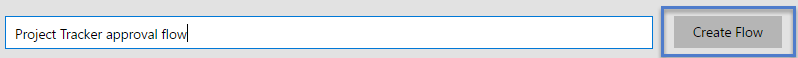

# Aguardar aprovação no Microsoft Flow
[!INCLUDE [view-pending-approvals](includes/cc-rebrand.md)]

> [!VIDEO https://www.youtube.com/embed/W6oxcYRtW-8?list=PL8nfc9haGeb55I9wL9QnWyHp3ctU2_ThF]
>

Crie um fluxo que, se você criar um item no SharePoint, enviará um email de aprovação e notificará se o item foi aprovado ou rejeitado. Para seguir este tutorial exatamente, crie uma lista simples do SharePoint como uma ação de gatilho, mas você pode usar outra fonte de dados, como dropbox ou OneDrive.

**Pré-requisitos**

* Crie uma lista simples do SharePoint denominada **rastreador de projeto**, adicione uma coluna denominada **title**e, em seguida, adicione uma coluna Person ou Group nomeada **atribuída a**.

   

## Adicionar um evento para disparar o fluxo

1. Entre [Microsoft Flow](https://flow.microsoft.com), selecione **meus fluxos** na barra de navegação superior e, em seguida, selecione **criar em branco**.

1. Selecione a caixa **Pesquisar centenas de conectores e gatilhos** , insira **novo item**e, em seguida, navegue até **SharePoint – quando um item é criado**.

1. Se solicitado, entre no SharePoint.
1. Em **endereço do site**, insira a URL do site do SharePoint que contém sua lista.

1. Em **nome da lista**, selecione a lista que você criou anteriormente. Se você estiver acompanhando, o nome será o **rastreador de projeto**.

    

## Adicionar a ação resultante

1. Selecione o botão **nova etapa** e, em seguida, selecione **Adicionar uma ação.**

1. Na caixa **Pesquisar todos os conectores e ações** , digite ou cole **Enviar email**e, em seguida, selecione **Office 365 Outlook-enviar email com opções**.

1. Se solicitado, entre no Office 365 Outlook.

1. Selecione o campo **para** e, em seguida, selecione o token **atribuído a email** .

    O usuário na coluna **atribuído a** recebe o email para aprovar ou rejeitar itens. Quando você cria um item para testar o fluxo, especifique-o nesse campo. Dessa forma, você não apenas aprova ou rejeita o item, mas também recebe o email de notificação.

    > [!NOTE]
    > Você pode personalizar os campos de **assunto** e de **Opções de usuário** para atender às suas necessidades.

    

## Adicionar uma condição

1. Selecione o botão **nova etapa** e, em seguida, selecione **Adicionar uma condição**.

    
1. Selecione a primeira caixa e, em seguida, selecione o token **SelectedOption** .
1. Selecione a última caixa e, em seguida, digite **aprovar**.

    

1. Na área **se sim** , selecione **Adicionar uma ação**.

1. Na caixa **Pesquisar todos os conectores e ações** , digite ou cole **Enviar email**e, em seguida, selecione **Office 365 Outlook-enviar um email**.

1. No campo **para** , insira um destinatário, como **criado por email**.

1. Na caixa **assunto** , especifique um assunto.

    Por exemplo, selecione **atribuído a DisplayName**, o tipo **foi aprovado** com um espaço em cada lado e, em seguida, selecione **título**.

1. Na caixa **corpo** , especifique um corpo de email, como **pronto, para prosseguir com a próxima fase do projeto.**

    > [!NOTE]
    > A pessoa que criou o item na lista do SharePoint será notificada se o projeto foi aprovado ou rejeitado.

    

1. Na área **se não** , repita as cinco últimas etapas, exceto alterar o **assunto** e o **corpo** para refletir que o projeto foi rejeitado.

     

## Concluir e testar seu fluxo

1. Dê um nome ao seu fluxo e, em seguida, selecione **criar fluxo**.

     
1. Crie um item em sua lista do SharePoint.

    Um email de aprovação é enviado para o destinatário que você especificou. Quando o destinatário seleciona **aprovar** ou **rejeitar** nesse email, você recebe um email que indica a resposta.

## Saiba Mais

* [Passo a passos de aprovações modernas de aprovador único](modern-approvals.md)
* Criar [aprovações sequenciais](sequential-modern-approvals.md)
* Criar [aprovações paralelas](parallel-modern-approvals.md)
* Aprovar [solicitações em qualquer lugar](mobile-approvals.md)
